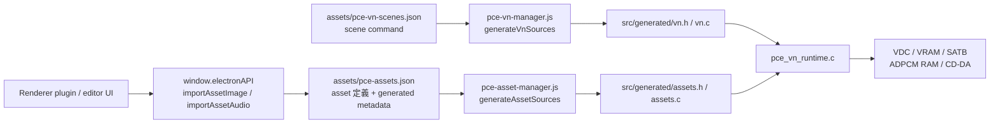
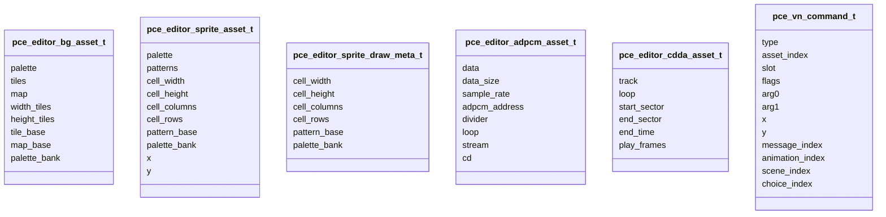
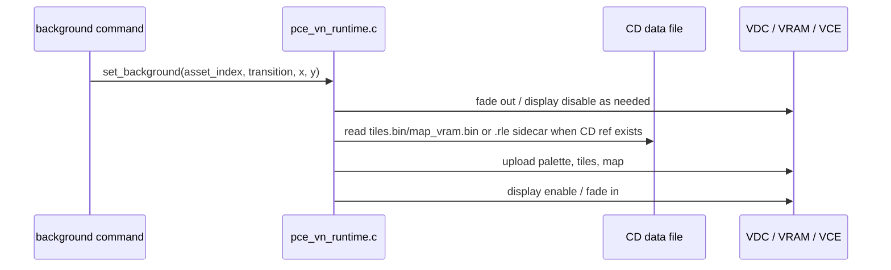
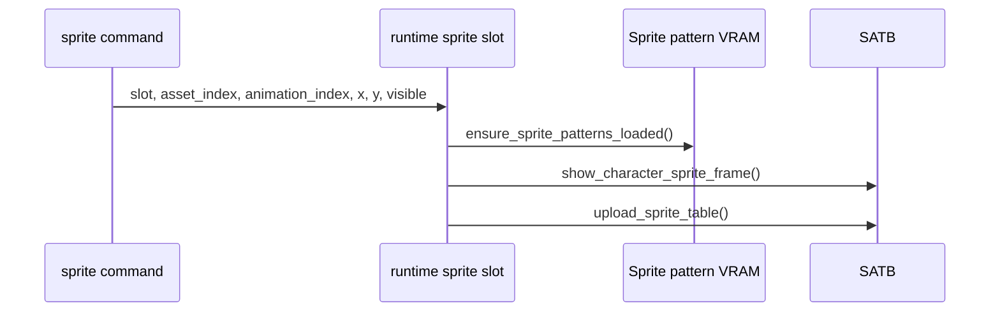
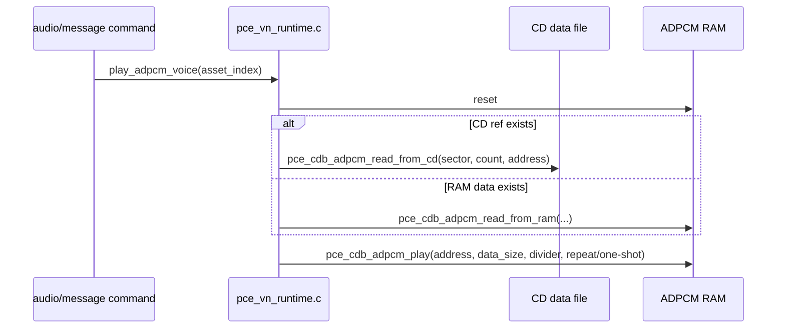
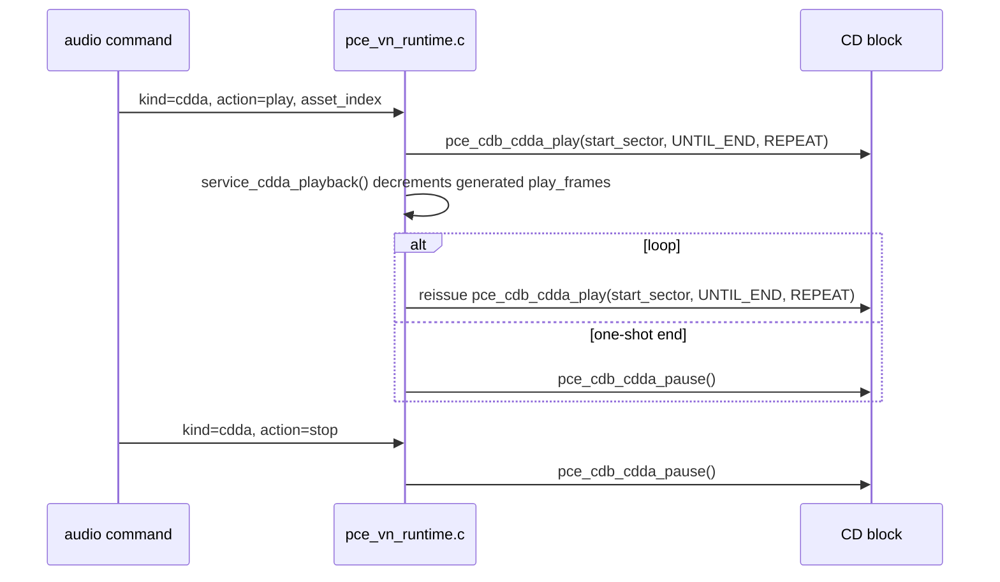

# PCE 画像・スプライト・ADPCM・CD-DA プログラミングガイド

このガイドは、PCE Game Editor の現行実装における背景画像、スプライト表示、ADPCM 再生、CD-DA 再生の API を、開発者が実装に使える形でまとめたものです。

対象は PC Engine / Super CD-ROM2 project です。特に Visual Novel runtime (`template/template_pce_vn_cd/src/pce_vn_runtime.c`) と、そこへ渡される asset / scene 生成物を中心に説明します。

## API の全体像

現行 API は、1 つの高水準 C 関数を直接呼ぶ形ではなく、次の 5 層に分かれています。



| 層 | 主なファイル/API | 役割 |
|---|---|---|
| Renderer IPC | `window.electronAPI.importAssetImage()` / `importAssetAudio()` / `listAssets()` | エディタや plugin から安全に asset を登録する |
| Asset schema | `assets/pce-assets.json` | 画像、スプライト、ADPCM、CD-DA の source/options/generated を保存する |
| Scene schema | `assets/pce-vn-scenes.json` | 背景表示、スプライト表示、音声再生を command として記述する |
| Generated C API | `src/generated/assets.h` / `vn.h` | runtime が参照する C struct / 配列へ変換する |
| Runtime | `src/pce_vn_runtime.c` | VRAM 転送、SATB 更新、ADPCM/CD-DA 再生を実行する |

## どの API を使うか

| やりたいこと | 登録 API | Asset type | Scene command | 生成 C struct | Runtime 側の主処理 |
|---|---|---|---|---|---|
| 背景画像を表示する | `importAssetImage({ kind: "background" })` | `image` | `background` | `pce_editor_bg_asset_t` | `set_background()` / `upload_bg_graphics()` |
| スプライトを表示する | `importAssetImage({ kind: "sprite" })` | `sprite` | `sprite` | `pce_editor_sprite_asset_t`, `pce_vn_sprite_anim_t` | `refresh_scene_sprites()` / `show_character_sprite_frame()` |
| ADPCM を鳴らす | `importAssetAudio({ kind: "adpcm" })` | `adpcm` | `audio` または `message.voiceAssetId` | `pce_editor_adpcm_asset_t` | `play_adpcm_voice()` / `stop_adpcm_voice()` |
| CD-DA を鳴らす | `importAssetAudio({ kind: "cdda-track" })` | `cdda-track` | `audio` | `pce_editor_cdda_asset_t` | `play_cdda_track()` / `stop_cdda_track()` |
| PSG を鳴らす | PSG asset を登録 | `psg-song` / `psg-sfx` | `audio` (`kind: "psg"`) | `pce_editor_psg_asset_t` | `play_psg_asset()` / `tick_psg()` / `stop_psg()` |
| 入力で分岐する | — | — | `inputcheck` | `pce_vn_command_t` | メインループの sync/async 入力ウォッチャ + `jump_to_command()` |
| 短い文字をスプライトで重ねる | — | — | `spritetext` | `pce_vn_command_t` + `pce_vn_font_sprite_data` | `draw_spritetext_slots()` / `upload_font_sprite_patterns()` / `tick_spritetext()` |

## Renderer IPC API

PC Engine project では、renderer から次の project-local IPC を使えます。

```js
const assets = await window.electronAPI.listAssets();

const bg = await window.electronAPI.importAssetImage({
  sourcePath: "/absolute/path/title.png",
  kind: "background",
  id: "title_bg",
  paletteBank: 0,
  transparentIndex: 0
});

const sprite = await window.electronAPI.importAssetImage({
  sourcePath: "/absolute/path/akari.png",
  kind: "sprite",
  id: "akari_sprite",
  paletteBank: 1,
  tileBase: 880,
  cellWidth: 16,
  cellHeight: 16,
  transparentIndex: 0
});

const voice = await window.electronAPI.importAssetAudio({
  sourcePath: "/absolute/path/voice.wav",
  kind: "adpcm",
  id: "voice_01",
  sampleRate: 16000,
  loop: false
});

const processedVoice = await audioConvertUi.openAudioConvertModal({
  mode: "pce-asset",
  returnResult: true,
  kind: "adpcm",
  picked: { sourcePath: "/absolute/path/voice.mp3", fileName: "voice.mp3", ext: ".mp3" },
  targetFileName: "voice_01.wav",
  defaults: { sampleRate: 16000, mono: true }
});

await window.electronAPI.importAssetAudio({
  dataUrl: processedVoice.dataUrl,
  sourceFileName: "voice_01.wav",
  originalFileName: processedVoice.originalFileName,
  processing: processedVoice.processing,
  splitPolicy: "auto",
  kind: "adpcm",
  id: "voice_01",
  sampleRate: processedVoice.processing.sampleRate
});

const cdda = await window.electronAPI.importAssetAudio({
  sourcePath: "/absolute/path/opening.wav",
  kind: "cdda-track",
  id: "opening_theme",
  track: 2,
  loop: false
});
```

| API | 戻り値の要点 | 注意 |
|---|---|---|
| `listAssets()` | `{ ok, file, assets }` | PC Engine core 専用 |
| `importAssetImage(payload)` | `{ ok, asset, assets, commandInfo, conversion }` | `sourcePath` は dialog 由来の絶対パス。保存先は project 相対に正規化 |
| `importAssetAudio(payload)` | `{ ok, asset, assets, conversion }` | WAV を ADPCM / CD-DA へ変換する。MP3 は `pce-audio-converter` の共通 UI で加工済み WAV Data URL にしてから渡す |
| `previewAssetSource(relativePath)` | `{ ok, dataUrl, mime, size }` | project root 内の相対パスのみ |
| `reorderAssets(ids)` | `{ ok, version, assets }` | `assets/pce-assets.json` の順序を保存 |
| `upsertAsset(asset)` / `deleteAsset(id)` | `{ ok, version, assets }` | 直接編集用。生成ファイル作成は import API が担当 |

`previewAssetSource()` と `reorderAssets()` は絶対パス、`..`、project root 外 escape を拒否します。`importAssetImage()` / `importAssetAudio()` の `sourcePath` は読み取り元として絶対パスを受けますが、保存される `source` と generated file path は project 相対です。`importAssetAudio()` に `dataUrl` を渡す場合は、その Data URL が project 内の `assets/adpcm/<id>.wav` または `assets/cdda/<id>.wav` として保存されます。

## Asset Schema

全 asset は `assets/pce-assets.json` に保存されます。

```jsonc
{
  "version": 2,
  "assets": [
    {
      "id": "title_bg",
      "type": "image",
      "name": "Title BG",
      "source": "assets/images/title_bg.png",
      "options": {},
      "data": {
        "generated": {},
        "import": {}
      }
    }
  ]
}
```

### 共通フィールド

| field | 型 | 説明 |
|---|---|---|
| `id` | `string` | scene command から参照する asset ID |
| `type` | `string` | `image`, `sprite`, `adpcm`, `cdda-track` など |
| `name` | `string` | UI 表示名 |
| `source` | `string` | project 相対の元ファイル |
| `options` | `object` | asset type ごとの設定 |
| `data.generated` | `object` | 変換済みファイル、サイズ、警告など |
| `data.import` | `object` | 元ファイル名、import 時刻、converter 名 |

### 背景画像 `image`

背景画像は 8x8 BG tile と BAT map に変換されます。CD-ROM2 target では、`tiles.bin` と `map_vram.bin` が CD data file として扱われます。`options.compression` は既定で `"auto"` になり、変換時に `tiles.rle` / `map_vram.rle` sidecar が raw より小さくなった場合は CD 上の参照だけ sidecar へ切り替わります。raw の `.bin` は preview / fallback / 非 CD build 用に残ります。

```jsonc
{
  "id": "classroom_bg",
  "type": "image",
  "source": "assets/images/classroom_bg.png",
  "options": {
    "kind": "background",
    "paletteBank": 0,
    "tileBase": 128,
    "mapBase": 0,
    "x": 0,
    "y": 0,
    "width": 288,
    "height": 128,
    "cellWidth": 8,
    "cellHeight": 8,
    "transparentIndex": 0,
    "compression": "auto"
  }
}
```

| option | 範囲/既定 | 説明 |
|---|---:|---|
| `kind` | `"background"` | `image` では background 固定 |
| `paletteBank` | `0..15` | BG palette bank |
| `tileBase` | 自動 `128` | BG tile を置く tile index。64x32 BAT の後ろに自動配置され、UI では編集しない |
| `mapBase` | 自動 `0` | BAT map 転送先 word address。BG は左上から描画するため自動固定され、UI では編集しない |
| `x`, `y` | `0..255` | asset UI/preview 用の配置情報。VN runtime のBG表示位置は scene の `background` command 側の `x` / `y` で指定する |
| `width`, `height` | `0..1024` | 画像サイズ。8px 単位推奨 |
| `cellWidth`, `cellHeight` | `8` | BG は 8x8 tile 固定 |
| `transparentIndex` | `0..15` | indexed/transparent 変換時の透明 index |
| `compression` | `"auto"` / `"none"` | CD-ROM2 用 BG tile/map sidecar の自動 RLE 圧縮。`auto` は圧縮後が小さい場合だけ採用 |

| generated field | 説明 |
|---|---|
| `paletteFile` | VCE color 16 色分の `palette.bin` |
| `tilesFile` | BG tile data `tiles.bin` |
| `mapFile` | compact map data |
| `mapVramFile` | CD-ROM2 VN runtime 用の64タイル幅ソース行 map |
| `tilesCompressedFile` | CD-ROM2 用 RLE sidecar。採用されない場合は空 |
| `mapVramCompressedFile` | CD-ROM2 用 RLE map sidecar。採用されない場合は空 |
| `compression` | `policy`, `tiles`, `map` の圧縮判定結果。`codec: "rle"` の時だけ CD data ref が sidecar を指す |
| `tileCount` | 8x8 tile 数 |
| `vramBytes` | tiles + map の概算 VRAM byte 数 |
| `warnings` | VRAM overlap やサイズ警告 |

### スプライト `sprite`

スプライトは PCE sprite pattern と sprite palette に変換されます。表示は VN scene の `sprite` command で行います。

```jsonc
{
  "id": "akari_sprite",
  "type": "sprite",
  "source": "assets/sprites/akari_sprite.png",
  "options": {
    "kind": "sprite",
    "paletteBank": 1,
    "tileBase": 880,
    "x": 128,
    "y": 24,
    "width": 64,
    "height": 128,
    "cellWidth": 16,
    "cellHeight": 16,
    "transparentIndex": 0,
    "compression": "auto",
    "animations": [
      {
        "id": "default",
        "name": "Default",
        "frameWidth": 64,
        "frameHeight": 128,
        "firstCell": 0,
        "frameCount": 1,
        "frameDelay": 8,
        "frameStrideCells": 32,
        "loop": true
      }
    ]
  }
}
```

| option | 範囲/既定 | 説明 |
|---|---:|---|
| `paletteBank` | `0..15` | sprite palette bank。runtime は sprite palette 領域 `256 + paletteBank * 16` へ転送 |
| `tileBase` | `0..2047`, 既定 `880` | C 生成後は `pattern_base`。sprite pattern の基準 index |
| `x`, `y` | `0..255` | 既定表示位置。scene command の `x`, `y` が実表示に使われる |
| `width`, `height` | `0..1024` | sheet 全体サイズ |
| `cellWidth`, `cellHeight` | `16x16`, `16x32`, `16x64`, `32x16`, `32x32`, `32x64` | PCE sprite cell size |
| `transparentIndex` | `0..15` | 透明 index |
| `compression` | `"auto"` / `"none"` | CD-ROM2 用 sprite pattern sidecar の自動 RLE 圧縮。`auto` は圧縮後が小さい場合だけ採用 |
| `animations` | 最大 16 件 | VN runtime 用 animation 定義 |

| animation field | 説明 |
|---|---|
| `id` | scene command の `animationId` で参照する ID |
| `frameWidth`, `frameHeight` | 1 frame の表示サイズ。cell size の倍数へ正規化 |
| `firstCell` | sheet 左上から数えた開始 cell index |
| `frameCount` | frame 数。最大 64 |
| `frameDelay` | 何 frame ごとに次 animation frame へ進めるか |
| `frameStrideCells` | 次 frame まで何 cell 進むか |
| `loop` | 最終 frame 後に先頭へ戻すか |

VN runtime では `frameCount: 1` の default animation を「sheet 全体表示」として扱います。口パク/目パチなど複数 frame を切り出したい場合だけ、`frameCount > 1` とし、`frameWidth` / `frameHeight` / `frameStrideCells` が sheet cell 範囲内に収まるようにしてください。CD-ROM2 では `patterns.rle` が raw `patterns.bin` より小さい場合だけ generated C metadata が RLE sidecar を指します。

### ADPCM `adpcm`

ADPCM は WAV から `assets/generated/<id>/adpcm.bin` へ変換されます。CD-ROM2 target では CD data file として配置され、通常は runtime が ADPCM RAM へ読み込んでから再生します。生成される ADPCM は OKI/MSM5205 互換の 4-bit adaptive data の高位 nibble 先 (`msn-first`) です。旧 `pce-cd-adpcm-experimental`、古い `lsn-first`、nibble order 未記録、または `encoderVersion` が古い generated file は、source WAV が残っていれば build/source 生成時に自動再生成されます。WAV / MP3 の加工 UI は `pce-audio-converter` が提供し、trim、正規化、volume dB、fade in/out、波形 preview、seek、sample rate、mono/stereo を適用した WAV Data URL を `importAssetAudio()` に渡します。

```jsonc
{
  "id": "voice_01",
  "type": "adpcm",
  "source": "assets/adpcm/voice_01.wav",
  "options": {
    "sampleRate": 16000,
    "loop": false,
    "stream": false,
    "adpcmAddress": 0,
    "divider": 14
  }
}
```

| option | 範囲/既定 | 説明 |
|---|---:|---|
| `sampleRate` | `4000..32000`, 既定 `16000` | ADPCM 変換時の目標 sample rate |
| `loop` | `false` | runtime の `pce_cdb_adpcm_play()` に repeat/one-shot として渡る |
| `stream` | `false` | `true` の場合は preload を行わない。ADPCM RAM に収まる asset は play 時に buffered 再生し、収まらない長尺 asset は CD data file を `pce_cdb_adpcm_stream()` で直接再生する |
| `adpcmAddress` | `0..65535` | ADPCM RAM 上の読み込み先 address |
| `divider` | `0..15`, 通常は自動 | `pce_cdb_adpcm_play()` / `pce_cdb_adpcm_stream()` に渡す ADPCM 再生 rate code。未指定や旧実装の自動値は `sampleRate` から補正する |

ADPCM の `divider` は音量ではなく再生速度です。PCE Game Editor は `32000 / (16 - code)` が `sampleRate` に最も近い `0..15` の code を自動計算し、代表値は `32000Hz -> 15`, `16000Hz -> 14`, `8000Hz -> 12`, `4000Hz -> 8` です。旧実装で保存された `round(32000 / sampleRate - 1)` や `round(16000 / sampleRate - 1)` の値は、読み込み時と runtime で現在の code へ補正します。たとえば `16000Hz + divider: 0/1` は約 2kHz/2.1kHz 再生になって長く低く鳴るため、現在は `divider: 14` として扱います。

`splitPolicy: "auto"` を指定した ADPCM import では、変換後の ADPCM が `min(65535, 65536 - adpcmAddress)` bytes を超える場合に `<id>_part01`, `<id>_part02`, ... の複数 asset へ分割されます。各 part は独立した `adpcm` asset で、`data.import.groupId`, `partIndex`, `partCount`, `splitPolicy`, `maxAdpcmBytes` を持ちます。runtime 自動連結は行わないため、scene command や `message.voiceAssetId` では必要な part を個別に参照してください。

1 asset あたりの再生可能時間は、おおよそ `maxBytes * 2 / sampleRate` 秒です。`adpcmAddress: 0` の上限 65535 bytes なら、16000Hz で約 8.19 秒、8000Hz で約 16.38 秒です。`adpcmAddress` を 0 以外にすると `65536 - adpcmAddress` が先に効くため、その分だけ短くなります。

`stream: true` の ADPCM は長尺音声向けです。`min(65535, 65536 - adpcmAddress)` bytes に収まる場合、runtime は互換性を優先して ADPCM RAM へ読み込む通常再生を使います。ADPCM RAM に収まらない場合は `pce_cdb_adpcm_stream()` へ CD sector と sector count を渡して直接 streaming 再生します。streaming 中は CD data read を同時に使えないため、BG/sprite の表示データや別 ADPCM preload は streaming 開始前に済ませてください。streaming asset は preload command では読み込まず、audio/message の再生タイミングで開始し、loop は data size と sample rate から計算した frame counter で再発行します。

ADPCM のノイズ原因を切り分ける場合は `samples/pce-adpcm-diagnostic` を使います。`node scripts/pce-adpcm-diagnostic.js analyze <source.wav> <adpcm.bin> <sampleRate>` は generated ADPCM を OKI/MSM5205 と旧実験形式、`lsn-first` / `msn-first` の各組み合わせで decode し、元 WAV との RMS error、SNR、correlation を表示します。`node scripts/pce-adpcm-diagnostic.js build` は VN runtime を通らず、System Card BIOS の `pce_cdb_adpcm_reset()` / `pce_cdb_adpcm_read_from_cd()` / `pce_cdb_adpcm_play()` / `pce_cdb_adpcm_stream()` だけを呼ぶ最小 CD-ROM2 ISO を生成します。

ADPCM 再生後の VN 進行確認は、標準 EmulatorJS/WASM だけで判断しないでください。Geargrafx / 外部エミュレーターで正常に message advance できる一方、標準 WASM の `mednafen_pce-wasm.data` だけ ADPCM 後に入力待ちから進まないケースがあります。この場合は、ADPCM command を抜いた比較 build、frame counter、`simulateInput()` 直接注入で入力経路を切り分け、Geargrafx で正常な runtime を標準 WASM 向けに壊す変更を入れないでください。特に「ADPCM 再生中に次 command へ進んだ」だけでは合格にせず、voice の自然終了後に次 message へ到達するかを ADPCMあり/なしの最小 scene で確認します。運用手順と再発防止チェックリストは `docs/pce-testplay-debugging.md` にまとめています。

### CD-DA `cdda-track`

CD-DA は WAV から `assets/generated/<id>/cdda.wav` へ正規化され、CD の audio track として bundle されます。MP3 入力の場合も renderer 側で加工済み WAV にしてから登録します。CD-DA は ADPCM のような自動分割を行いません。

```jsonc
{
  "id": "opening_theme",
  "type": "cdda-track",
  "source": "assets/cdda/opening_theme.wav",
  "options": {
    "track": 2,
    "loop": false
  }
}
```

| option | 範囲/既定 | 説明 |
|---|---:|---|
| `track` | `2..99`, 既定 `2` | CD-DA track 番号。track 1 は data track なので使わない |
| `loop` | `false` | `true` の場合、現行 VN runtime は `play_frames` 到達時に同じ track の再生命令を再発行する |

## Scene Command API

Visual Novel project では `assets/pce-vn-scenes.json` の `commands` が表示/再生のプログラミング API です。

```jsonc
{
  "version": 2,
  "startScene": "opening",
  "scenes": [
    {
      "id": "opening",
      "commands": [
        { "type": "background", "assetId": "classroom_bg", "transition": "fade", "fadeOutFrames": 8, "fadeInFrames": 16, "x": 0, "y": 0 },
        { "type": "sprite", "slot": 0, "assetId": "akari_sprite", "x": 128, "y": 24, "animationId": "default", "flipX": false, "flipY": false, "durationFrames": 0, "visible": true },
        { "type": "effect", "effect": "shake", "frames": 20, "intensity": 6 },
        { "type": "audio", "kind": "cdda", "action": "play", "assetId": "opening_theme" },
        { "type": "variable", "variableName": "route", "operation": "define", "value": 0 },
        { "type": "message", "speaker": "アカリ", "text": "こんにちは", "voiceAssetId": "voice_01", "textSpeedFrames": 2 },
        { "type": "choice", "variableName": "route", "choices": [{ "label": "進む", "value": 1 }, { "label": "待つ", "value": 2 }] },
        { "type": "if", "variableName": "route", "operator": "eq", "value": 1, "targetLabel": "go_next", "elseLabel": "stay" },
        { "type": "label", "name": "go_next" },
        { "type": "goto", "targetLabel": "after_branch" },
        { "type": "label", "name": "stay" },
        { "type": "switch", "variableName": "route", "cases": [{ "value": 2, "targetLabel": "stay" }], "defaultLabel": "after_branch" },
        { "type": "label", "name": "after_branch" },
        { "type": "audio", "kind": "adpcm", "action": "stop", "assetId": "" }
      ],
      "nextSceneId": ""
    }
  ]
}
```

### 背景表示 command

```jsonc
{ "type": "background", "assetId": "classroom_bg", "transition": "fade", "fadeOutFrames": 8, "fadeInFrames": 16, "x": 0, "y": 0 }
```

| field | 値 | 説明 |
|---|---|---|
| `type` | `"background"` | 背景切替 |
| `assetId` | `image` asset ID | 無効な ID は最初の `image` asset へ fallback される |
| `transition` | `"cut"` / `"fade"` | `fade` は palette fade を使う |
| `fadeOutFrames` | `0..60` | 現背景を暗転する frame 数 |
| `fadeInFrames` | `0..60` | 次背景を表示する frame 数 |
| `x`, `y` | `0..63` / `0..31` | 64x32 BAT 上の描画開始タイル座標。未指定時は `(0, 0)` |

### スプライト表示 command

```jsonc
{ "type": "sprite", "slot": 0, "assetId": "akari_sprite", "x": 128, "y": 24, "animationId": "default", "flipX": false, "flipY": false, "durationFrames": 0, "visible": true }
```

| field | 値 | 説明 |
|---|---|---|
| `type` | `"sprite"` | sprite slot の表示状態を更新 |
| `slot` | `0..3` | VN runtime の論理 slot。最大 4 slot を同時保持し、同じ slot への再指定で差し替え/非表示。`message.mouthSlot` が参照する |
| `assetId` | `sprite` asset ID | `visible: true` で無効な ID の場合 command 自体が正規化で除外される |
| `x`, `y` | `0..319`, `0..223` | 画面座標。runtime は PCE SATB 用に `x + 32`, `y + 64` へ補正 |
| `animationId` | animation ID | 未指定時は `default` |
| `flipX`, `flipY` | `boolean` | sprite pattern の描画向きを水平/垂直反転する |
| `durationFrames` | `0..255` | エディタの **Move**。同じ slot が表示中（直前も今回も visible）かつ値 ≧ 1 のときだけ有効で、`animate_sprite_slot()` が毎フレーム 1px ずつ現在位置から `x`, `y` へ近づけ、最終フレームで目的座標へ確定する（= 速度上限 1px/frame）。距離 > frame 数なら残りは最後にスナップする。初回表示・非表示→表示・`0` は即時配置 |
| `visible` | `boolean` | `false` なら slot を非表示にする |

### 演出 command

```jsonc
{ "type": "effect", "effect": "fadeOut", "frames": 16 }
{ "type": "effect", "effect": "fadeIn", "frames": 16 }
{ "type": "effect", "effect": "blank", "frames": 0 }
{ "type": "effect", "effect": "shake", "frames": 20, "intensity": 6 }
```

| field | 値 | 説明 |
|---|---|---|
| `type` | `"effect"` | 画面演出 command |
| `effect` | `"fadeOut"` / `"fadeIn"` / `"blank"` / `"shake"` | 暗転、復帰、画面消去、画面シェイク |
| `frames` | `0..255` | fade / shake の実行 frame 数。`blank` では保持されるが実行時間には使わない |
| `intensity` | `1..16` | `shake` の揺れ幅。`shake` 以外では `0` に正規化される |

### スプライト文字オーバーレイ command (`spritetext`)

短い文字列を**ハードウェアスプライト**で BG / メッセージ UI の上に重ねて表示する command です。通常のメッセージ本文は BG タイルへ描画しますが、`spritetext` は「PRESS RUN BUTTON」のような演出用の短い文字を、BG の上に浮かせたり点滅させたりするために使います。

```jsonc
{ "type": "spritetext", "slot": 0, "text": "PRESS RUN BUTTON", "x": 64, "y": 184, "color": "#ffff00", "blinkFrames": 30, "visible": true }
{ "type": "spritetext", "slot": 0, "visible": false }
```

| field | 値 | 説明 |
|---|---|---|
| `type` | `"spritetext"` | スプライト文字オーバーレイ |
| `slot` | `0..3` | オーバーレイ slot。同じ slot への再指定で差し替え、`visible: false` で消去。最大 4 slot を同時保持 |
| `text` | 最大 64 文字 | 表示文字列。改行 `\n` で 2 行目以降へ送る。1 command あたり描画グリフ数は **32 まで**（改行も 1 つ消費）で、超過分は切り捨て |
| `x`, `y` | `0..319`, `0..223` | 左上の画面座標。runtime は PCE SATB 用に `x + 32`, `y + 64` へ補正し、`shake` 時は BG/sprite と同じ offset で揺れる |
| `color` | `#rrggbb` | 文字色。PCE 9bit GRB に丸めて表示。空欄は白 (`#ffffff`)。**同時表示時は 1 色**（後勝ち、後述） |
| `blinkFrames` | `0..255` | `0` で常時表示。`1` 以上で `blinkFrames` フレームごとに表示/非表示をトグル（点滅） |
| `visible` | `boolean` | `false` で slot を消去 |

`spritetext` で使う文字は、メッセージ用の BG グリフフォントとは別に、**スプライト用フォント (`assets/generated/vn/font_sprite.bin`)** として build 時に自動生成されます。エンコードされるのは `spritetext` が実際に使う文字種だけで、起動時に 1 回だけスプライト VRAM (`PCE_VN_FONT_SPRITE_PATTERN_BASE`) へ転送されます。BG フォントに日本語が大量にあってもスプライトフォントは肥大化しません。

制約（PCE ハードウェア由来）:

- スプライト文字は character sprite と同じ **64 entry の SATB / 1 走査線 16 スプライト**を共有します。1 文字 = 16x16 = 1 スプライトなので、立ち絵と合わせて 64 を超えないように短く保ってください。超過分は描画されません。
- 文字色は**予約スプライトパレットバンク** (`PCE_VN_FONT_SPRITE_PALETTE_BANK`、既定 15) の index 15 を runtime が書き換えて表現します。複数 slot を同時表示すると最後に描いた slot の色が全 slot に適用されます（同時に別色を出したい場合は表示タイミングをずらしてください）。スプライト asset の palette bank は既定 1 なので衝突しませんが、bank 15 を asset に割り当てている場合は避けてください。
- スプライトフォントの pattern 領域は BG グリフフォント直後（既定 sprite asset tileBase 880 の手前）へ自動配置します。文字種が多すぎてスプライト asset の pattern 領域や SATB と重なる場合は build 時に warning を出します。

点滅以外の表現（数フレームでフェード、移動など）は、`spritetext` の表示/非表示と既存の `wait` / `goto` / `inputcheck` を組み合わせて作れます。

### ADPCM 再生 command

```jsonc
{ "type": "audio", "kind": "adpcm", "action": "play", "assetId": "voice_01" }
{ "type": "audio", "kind": "adpcm", "action": "stop", "assetId": "" }
```

| field | 値 | 説明 |
|---|---|---|
| `type` | `"audio"` | 音声 command |
| `kind` | `"adpcm"` | ADPCM を対象にする |
| `action` | `"play"` / `"stop"` | 再生または停止 |
| `assetId` | `adpcm` asset ID | `play` のときだけ参照 |

`message` command の `voiceAssetId` でも ADPCM を再生できます。

```jsonc
{
  "type": "message",
  "text": "こんにちは",
  "voiceAssetId": "voice_01",
  "textSpeedFrames": 2,
  "advanceMode": "button"
}
```

`voiceAssetId` に ADPCM が指定されている場合、runtime は文字送り速度を ADPCM の再生長から自動算出します。再生フレーム数 ≒ `data_size * 2 / sampleRate * 60`（`adpcm_voice_frame_count()`）を本文の glyph 数で割り、1 文字あたりの表示フレーム（1..255 にクランプ）として `textSpeedFrames` を上書きします。これにより本文が最後まで表示されるタイミングと音声終了がほぼ同期します。`advanceMode: "button"` で typewriter をボタンスキップ（即時全文表示）した後、さらにボタンで次ページへ送ると、まだ再生中の ADPCM は `stop_adpcm_voice()` で停止します。ループ ADPCM や streaming ADPCM（再生長が不定）の場合は同期せず `textSpeedFrames` をそのまま使います。

### PSG 再生 command

```jsonc
{ "type": "audio", "kind": "psg", "action": "play", "assetId": "chime", "channel": 0 }
{ "type": "audio", "kind": "psg", "action": "stop", "assetId": "" }
```

| field | 値 | 説明 |
|---|---|---|
| `kind` | `"psg"` | PSG (`psg-song` / `psg-sfx`) asset を対象にする |
| `action` | `"play"` / `"stop"` | 再生または停止 |
| `assetId` | `psg-song` / `psg-sfx` asset ID | `play` のとき参照 |
| `channel` | `0..5`, 既定 `0` | 基準 PSG チャンネル |

VN runtime は PSG asset の step パターンをフレーム駆動シーケンサ (`tick_psg()`) で 1 step ずつ再生します。`psg-song` はパターン末尾で先頭へループ、`psg-sfx` はパターン終了で停止するワンショットです。指定した `channel` を基準チャンネルとし、各 step の channel をそこからのオフセットとして加算、0..5 にクランプして発音します（同じ SFX を別チャンネルへ振り分けられます）。1 step のフレーム数は asset の `bpm` から算出します（`3600 / (bpm * 4)`、2..24 frame にクランプ）。`action: "stop"` は再生中に使用したチャンネルだけを停止します。CD-DA や ADPCM とは独立して鳴らせます。

### CD-DA 再生 command

```jsonc
{ "type": "audio", "kind": "cdda", "action": "play", "assetId": "opening_theme" }
{ "type": "audio", "kind": "cdda", "action": "stop", "assetId": "" }
```

| field | 値 | 説明 |
|---|---|---|
| `kind` | `"cdda"` | CD-DA track を対象にする |
| `action` | `"play"` / `"stop"` | `play` は track 再生、`stop` は pause |
| `assetId` | `cdda-track` asset ID | `play` のとき `options.track` が runtime へ渡る |

現行 VN runtime の CD-DA 再生は、明示的な audio command がある場合だけ開始します。開始位置は `cdda-track.options.track` から生成した `start_sector`、終了位置は `PCE_CDB_LOCATION_TYPE_UNTIL_END` として `pce_cdb_cdda_play()` を呼びます。track 境界は BIOS の明示終了指定ではなく、WAV 長から生成した `play_frames` を runtime が毎 VBlank で減算して管理します。CD-ROM2 VN runtime は VDC 表示制御を直接所有するため、VBlank は `PCE_CDB_MASK_VBLANK_NO_BIOS` で有効化し、`pce_cdb_wait_vblank()` が使う BIOS R5 shadow も runtime 側で更新します。`cdda-track.options.loop` が `true` の場合は境界直前で同じ asset の開始 sector へ再生命令を再発行し、`false` の場合は `pce_cdb_cdda_pause()` で停止します。

### Preload command

```jsonc
{ "type": "preload", "sceneId": "next_scene" }
```

`preload` は指定 scene の active cache を走査し、暗転中なら背景 tiles/map、sprite patterns、ADPCM data の先読みを試みる command です。CD-DA は audio track なので CD data file の preload 対象ではありません。CD-ROM2 VN runtime は別 scene 用の preload scan cache を持たず、`sceneId` が別 scene を指す場合は active cache を一時的に target scene へ切り替えて最初の `message` / `choice` / `wait` / `jump` までに必要な初期表示 asset を先読みし、その後 current scene pack を読み戻します。表示中に `preload` を実行した場合は現在の画面を変えず、ADPCM data だけを先読みします。BG/Sprite の VRAM 先読みは、直前の `effect: "fadeOut"` / `effect: "blank"` などで display が暗転待ち (`pending_display_enable`) になっている場合だけ行われます。

scene 入場時の runtime は、scene pack を active cache (`4096` bytes) へ読み込んでから、最初の `message` / `choice` / `wait` / `jump` までに必要な asset だけを先読みします。scene 後半の背景・sprite・ADPCM は必要になった時点で読み込むため、起動直後や scene 切替直後の長い同期ロードを避けやすくなります。BG/Sprite は各 `background` / `sprite` command でも固定 VRAM 領域へ反映されるため、scene 末尾の表示 command がメッセージ待ちを飛び越えて先に見えることはありません。script pack 読み込みも CD data read なので、CD-DA と同時には行えません。CD-DA を維持したい scene では BG/Sprite command を CD-DA の前に置いてください。

現行 runtime は ADPCM の preload/cache 状態を `loaded_adpcm_valid` / `loaded_adpcm_index` で管理します。すでに同じ ADPCM が読み込まれている場合、preload は controller を reset/load しません。また ADPCM 再生中の preload は ADPCM RAM の再読み込みを避けるため、背景表示などの preload が再生中の音声を壊しません。CD data file を読む前には再生中の CD-DA を `pce_cdb_cdda_pause()` で止め、ADPCM 読み込みに失敗した場合は cache valid にせず再生もしません。音声の確実な再生制御をしたい場合は、まず `audio` command または `message.voiceAssetId` を主 API として使い、`preload` は表示データの読み込みタイミング調整を主目的にしてください。

### 変数と分岐 command

```jsonc
{ "type": "variable", "variableName": "score", "operation": "define", "value": 0 }
{ "type": "variable", "variableName": "score", "operation": "add", "value": 1 }
{ "type": "variable", "variableName": "roll", "operation": "random", "min": 1, "max": 6 }
```

| field | 値 | 説明 |
|---|---|---|
| `type` | `"variable"` | runtime 変数を操作する |
| `variableName` | ID | build 時に小さな index へ変換される変数名 |
| `operation` | `"define"` / `"set"` / `"add"` / `"sub"` / `"random"` | 初期定義、代入、加算、減算、範囲ランダム |
| `value` | signed 16-bit | `define` / `set` / `add` / `sub` で使う値 |
| `min`, `max` | signed 16-bit | `random` の範囲 |

```jsonc
{
  "type": "choice",
  "variableName": "route",
  "defaultIndex": 0,
  "choices": [
    { "label": "進む", "value": 1 },
    { "label": "待つ", "value": 2, "targetSceneId": "opening" }
  ]
}
```

`choice.variableName` が指定されている場合、I/II/RUN で確定した選択肢の `value` を変数へ代入します。`targetSceneId` は従来互換の scene 遷移として残っており、未指定なら同じ scene の次 command へ進みます。

```jsonc
{ "type": "label", "name": "route_a" }
{ "type": "if", "variableName": "route", "operator": "eq", "value": 1, "targetLabel": "route_a", "elseLabel": "route_b" }
{ "type": "switch", "variableName": "route", "cases": [{ "value": 1, "targetLabel": "route_a" }], "defaultLabel": "route_b" }
{ "type": "goto", "targetLabel": "route_a" }
```

`label` は同一 scene 内の分岐先を定義する no-op command です。`if` は `eq` / `ne` / `lt` / `lte` / `gt` / `gte` で比較し、条件成立時に `targetLabel`、不成立時に `elseLabel` へ command pointer を移動します。`switch.cases` は増減可能で、最初に一致した `value` の `targetLabel` へ移動し、一致しない場合は `defaultLabel` へ移動します。`goto` は指定 label へ無条件移動します。表示待ちのないGOTOループで実機を固めないよう、runtime は1回の advance あたり1024 commandで1 frame待つガードを持ちます。

```jsonc
{ "type": "inputcheck", "mode": "sync",   "buttons": ["i", "right"], "targetLabel": "go_next" }
{ "type": "inputcheck", "mode": "async",  "buttons": ["ii"],         "targetLabel": "skip" }
{ "type": "inputcheck", "mode": "cancel" }
```

`inputcheck` は指定ボタンの入力で同一 scene 内の `targetLabel` へ GOTO する分岐 command です。`buttons` は `up` / `down` / `left` / `right` / `select` / `run` / `i` / `ii` の OR 条件（コンパクトなトグル UI で指定）。`mode` は 3 種です。

| mode | 動作 |
|---|---|
| `sync` | 条件入力があるまで同期待機し、入力が来たら `targetLabel` へ GOTO する |
| `async` | 待機状態を保持したまま次 command へ進み、以後どのフレームでも条件成立で `targetLabel` へ GOTO する |
| `cancel` | 保持中の非同期待機を終了する |

非同期待機は単一ウォッチャ（同時に 1 つ）で、scene 切替時に自動でクリアされます。ボタンマスクは command record の `arg0`、`mode` は `flags`、移動先 label index は `x` に格納します。

## Generated C API

Build 時に `pce-asset-manager.js` と `pce-vn-manager.js` が `src/generated/assets.h` / `assets.c` / `vn.h` / `vn.c` を生成します。



| C symbol | 内容 |
|---|---|
| `pce_editor_bg_assets[]` / `_count` | `image` asset の generated palette/tile/map metadata |
| `pce_editor_sprite_assets[]` / `_count` | `sprite` asset の generated palette/pattern metadata |
| `pce_editor_sprite_draw_meta[]` | sprite SATB 構築用の compact metadata。cell size、sheet cell 数、pattern base、palette bank を常駐側から読む |
| `pce_editor_adpcm_assets[]` / `_count` | `adpcm` asset の data size, address, divider, loop, CD sector metadata |
| `pce_editor_cdda_assets[]` / `_count` | `cdda-track` asset の track/loop metadata |
| `pce_vn_sprite_animations[]` / `_count` | `sprite.options.animations` を cell 単位へ正規化した metadata |
| `pce_vn_scene_packs[]` / `_count` | scene pack の CD sector、sector count、byte size、next scene |
| `pce_vn_variable_initial_values[]` / `_count` | runtime 変数の初期値 |

`voice_index`、`asset_index`、`message_index`、`animation_index`、`scene_index`、`choice_index`、`target_scene`、`variable_index`、`next_scene` は `-1` sentinel を持つため `signed int` として生成します。scene 数、variable 数、sprite animation 数は `unsigned char` で公開するため build 時に 255 件を上限として検証します。CD-ROM2 VN の command/message/choice/switch は scene pack 内の local index になり、上限は scene ごとに 255 件です。1 scene pack は runtime cache に合わせて 4096 bytes 以下である必要があります。

PCE-CD / Super CD-ROM2 build では、llvm-mos の既定 `.text` / `.rodata` は常駐 `ram_bank128` に配置されます。VN runtime は command interpreter、sprite refresh、ADPCM 制御、scene pack command/message reader を `.ram_bank129`、scene pack choice/switch reader と preload helper を `.ram_bank130`、sprite animation、variable 初期値、scene pack directory、font tiles の CD data ref を `.ram_bank132` に明示配置し、bank128 に全 runtime/data を詰め込まない構成にしています。bank131 は例外的な小さい CPU-readable fallback data 用に残し、scene script、背景 tiles/map、sprite pattern、ADPCM 本体、**グリフフォント (`assets/generated/vn/font.bin`)** は `cd.dataFiles` から active cache / VRAM / ADPCM RAM へ転送します。font tiles は起動時に 1 回だけ VRAM へストリームし、`pce_vn_font_data` (sector/サイズ) だけを bank132 に残すため、glyph 数を増やしても bank132 を圧迫しません。glyph index は 16bit エスケープ符号化（0..252 は 1 byte、253 以上は `0xfd`+16bit LE）のため旧 254 種上限を超えられ、残る上限は VRAM tile のみです（既定 `tileBase` でおよそ 1000 種 = `VN_MAX_GLYPH_COUNT`。build 時に `computeFontBudget()` が検査）。詳細な割り当てと変更時の注意は `docs/pce-memory-bank-strategy.md` を参照してください。

VN sprite runtime は `pce_editor_sprite_draw_meta[]` を `sprite_draw_meta` へコピーしてから SATB を組みます。animation metadata は `frame_count > 1` かつ sheet 範囲内のときだけ 1 frame の表示サイズとして使い、単一 frame/default animation は sheet 全体表示へ戻します。VDC memory control は `VN_VDC_MEMORY_CONTROL` (`VDC_CYCLE_4_SLOTS | VDC_BG_SIZE_64_32`) を使い、BG size 更新時に sprite cycle bit を落とさないことを前提にしています。

CD-ROM2 VN runtime は `map_vram.bin` を `mapBase` から丸ごとVRAMへ置くblobとして扱いません。raw `map_vram.bin` または RLE sidecar は1行64タイルのソースとしてCDから読み、各行の `width_tiles` 分だけを `mapBase + command.y * 64 + command.x + row * 64` にコピーします。これにより、背景画像より広い画面領域の左右/上下余白は blank tile のまま残り、CD map paddingの0 wordが古いVRAM tileを参照して縦縞になる事故を防ぎます。BG command の fade は BG palette bank だけを暗く/明るくし、display layer 全体を無効化しないため、メッセージ UI palette までは暗転しません。

`pce_vn_runtime.c` 内の `set_background()`、`play_adpcm_voice()` などは現状 `static` な内部実装です。外部 plugin や game code から直接呼ぶ公開 C API ではなく、公開面は scene JSON と generated C struct / 配列です。

## Runtime の動き

### 背景画像



背景は `upload_bg_graphics()` で palette、tiles、map を転送します。BG map は `VN_MAP_WIDTH = 64` の BAT として扱われます。CD-ROM2 target では raw data sector を `cd_transfer_scratch` へ読み込み `pce_editor_vram_copy()` で VRAM へ転送します。RLE sidecar が採用された BG/Sprite は、CD sector を小さな byte stream として読みながら VRAM へ直接展開し、展開後全体を置く RAM buffer は確保しません。

### スプライト



runtime は 4 つの論理 sprite slot を持ちます。1 slot の animation frame は `frameWidth` / `frameHeight` に応じて複数の hardware sprite entry を消費します。SATB 全体は 64 entry です。

複数の sprite asset を同時表示する場合は、`tileBase` が同じだと pattern VRAM を上書きし合います。複数 actor を同時に出したい場合は、asset ごとに重ならない `tileBase` を割り当ててください。

### ADPCM



`adpcm.options.loop` は `PCE_CDB_ADPCM_REPEAT` / `PCE_CDB_ADPCM_ONE_SHOT` の選択に使われます。停止は `pce_cdb_adpcm_stop()` です。

CD-ROM2 runtime は llvm-mos SDK の `pce_cdb_adpcm_*` API 経由で System Card BIOS の ADPCM 機能を使います。通常経路は `pce_cdb_adpcm_read_from_cd()` / `pce_cdb_adpcm_read_from_ram()` で ADPCM RAM へ読み込んでから `pce_cdb_adpcm_play()` します。`adpcm.options.stream` が `true` の asset は preload をスキップし、ADPCM RAM に収まる場合は play 時に buffered 再生します。ADPCM RAM に収まらない長尺 asset だけ `ad_stream_start` 相当の `pce_cdb_adpcm_stream()` で CD data file を直接 streaming 再生します。

ADPCM RAM への読み込みが成功した場合だけ BIOS status の busy bit が落ちるまで待ってから `pce_cdb_adpcm_play()` を呼び、`play` がエラーを返した場合は cache valid を落として次回再読み込みします。再生開始時には直前の ADPCM を `pce_cdb_adpcm_stop()` で止めてから再生し、同じ asset の連続再生でも BIOS に active 状態のまま `play` を重ねません。ADPCM の data size、address、divider、loop、stream、CD sector は BIOS 呼び出し前に runtime-owned snapshot へ直接コピーし、CD / ADPCM BIOS helper のあとに MPR が変わっても bank128 の asset metadata を読み間違えないようにします。さらに再生中は scene preload が ADPCM controller を reset しないため、音声 command の直後に背景や sprite の preload が入っても再生中サンプルを破壊しません。ADPCM streaming は、ADPCM RAM に収まらない長尺 asset だけ direct streaming 経路を使います。ADPCM RAM に収まる `stream: true` asset は buffered 再生します。非loop の buffered / streaming 再生は、再生開始後に `pce_cdb_adpcm_status()` の stopped bit を毎 frame 監視せず、data size と sample rate から計算した frame counter で自然終了を管理します。自然終了後に追加の `pce_cdb_adpcm_stop()` / `pce_cdb_adpcm_reset()` は発行しません。標準 EmulatorJS/WASM core では buffered ADPCM one-shot の完了IRQで CPU が止まることがあるため、runtime は ADPCM load / CD data read / stop など BIOS 操作時だけ external IRQ を有効にし、非loop buffered 再生中は完了IRQをマスクします。streaming loop も同じ frame counter で再発行します。ADPCM BIOS call 直後の message advance edge が落ちることもあるため、ADPCM 再生開始後は次の joypad edge 判定を一度だけ初期化します。ADPCM BIOS helper は表示状態や VDC timing register を変えることがあるため、runtime は ADPCM load/play/stream 後に 256x224 の解像度、BG size、SATB start、scroll、R5 shadow を再適用します。表示中なら display を戻し、暗転中 preload では意図した暗転を維持します。VN の audio command は `pce_cdb_adpcm_play()` / `pce_cdb_adpcm_stream()` を開始したら待ち状態を返さず次の command へ進みます。ただし未 preload の通常 ADPCM と stream 指定 asset の buffered 再生は、再生開始前の ADPCM RAM 読み込みだけ同期的に完了待ちします。CD-DA 再生中に ADPCM や画像/sprite の CD data file を読む場合は、CD drive を data read に戻すため runtime が CD-DA を pause します。
Generated C の `data_size` は `unsigned long` field として出力し、長尺 ADPCM でも llvm-mos の16bit `unsigned int` literal に丸められないようにします。ここが丸まると、ADPCM RAM に収まらない stream asset を runtime が buffered 再生可能と誤判定します。

ADPCM 後の進行停止を直す場合は、`docs/pce-testplay-debugging.md` の「標準 WASM だけ ADPCM 後に進まない場合」を先に確認してください。command scheduler、joypad edge、ADPCM 完了IRQによる CPU 停止は見た目が似ているため、入力なしで完了後の next message へ進む最小 scene と、`voiceAssetId` を外した対照 build の両方を標準 WASM core で確認してから runtime を変更します。

### CD-DA



CD-DA は `cdda-track.options.track` 順で CUE に並べられ、asset 生成時に各 track の開始 sector が `pce_editor_cdda_asset_t.start_sector` へ保存されます。現行 runtime では track が 2 未満なら再生しません。再生開始時に古い CD-DA があれば `pce_cdb_cdda_pause()` で止め、`PCE_CDB_LOCATION_TYPE_SECTOR` と `PCE_CDB_LOCATION_TYPE_UNTIL_END` を指定して `pce_cdb_cdda_play()` を呼びます。BIOS へ track 番号や sector/time 終端を渡す形は、track 3 指定時に track 2 から流れたり GearGrafx 上で PLAYING へ遷移しなかったりするケースがあったため使っていません。また SubQ polling は再生を IRQ stop させることがあったため、runtime の loop/stop 判定にも使いません。

track 境界と loop は、asset 生成時に WAV の sample count から算出した `play_frames` で管理します。`play_frames` はトラック境界へ食い込まないように短い guard frame を差し引いた値です。loop 有効時はこのカウンターが 0 になった時点で同じ asset の開始 sector へ `pce_cdb_cdda_play()` を再発行し、loop 無効時は `pce_cdb_cdda_pause()` で止めます。

## 音量とフェード

ADPCM / CD-DA の任意 volume 値を asset や scene command から直接指定する runtime API は、現行実装にはありません。`pce-audio-converter` の volume / normalize / fade は import 時に WAV 波形へ焼き込まれる加工です。

CD BIOS には `pce_cdb_fader()` があり、CD-DA 側は `PCE_CDB_FADER_PCM_2_5_SEC` / `PCE_CDB_FADER_PCM_6_SEC`、ADPCM 側は `PCE_CDB_FADER_ADPCM_2_5_SEC` / `PCE_CDB_FADER_ADPCM_6_SEC` を選べます。これは任意音量のミキサーというより、CD unit の fader mode を起動する API です。フェードアウト用途は追加しやすい一方で、フレーム単位の volume curve や汎用 fade-in は現行 scene API だけでは表現できません。

ADPCM の `divider` は再生周波数/速度側の値で、音量ではありません。

## スプライトのフェード

背景 fade は `fade_palette()` が BG palette bank を段階的に暗く/明るくすることで実現しています。スプライトは VCE の sprite palette 領域 (`256 + paletteBank * 16`) を使うため、現行 runtime の背景 fade だけでは一緒にフェードしません。BG command 単体では display layer 全体を落とさないため、メッセージ表示中にBGを切り替えても UI palette は巻き込まれません。

スプライト fade 自体は palette fade と同じ考え方で実装可能です。visible slot の `pce_editor_sprite_asset_t.palette` を集め、sprite palette 領域に対して `fade_palette()` 相当の処理を行えば、立ち絵を背景と同じように暗転できます。ただし現行 API には sprite command ごとの `transition` や `fadeFrames` はまだありません。

## 実装レシピ

### 背景を追加して表示する

1. `importAssetImage({ kind: "background", id: "classroom_bg", ... })` で登録する。
2. `assets/pce-vn-scenes.json` の command に `{ "type": "background", "assetId": "classroom_bg" }` を追加する。
3. build 時に `pce_editor_bg_assets[]` と scene pack / `pce_vn_scene_packs[]` が生成される。
4. runtime が command 実行時に VRAM と palette を転送する。

### スプライトを追加して表示する

1. `importAssetImage({ kind: "sprite", id: "akari_sprite", cellWidth: 16, cellHeight: 16 })` で登録する。
2. 必要なら `options.animations` に `mouth`、`blink` などを定義する。
3. scene に `{ "type": "sprite", "slot": 0, "assetId": "akari_sprite", "animationId": "default", "visible": true }` を追加する。
4. 口パクなどは `message.mouthSlot` と `message.mouthAnimationId` で message 中に animation を切り替える。

### ADPCM ボイスを message に付ける

1. `importAssetAudio({ kind: "adpcm", id: "voice_01", sampleRate: 16000 })` で登録する。
2. message command に `"voiceAssetId": "voice_01"` を指定する。
3. 通常経路では、message 開始時に runtime が ADPCM を読み込み、`pce_cdb_adpcm_play()` を呼ぶ。

### CD-DA BGM を再生する

1. `importAssetAudio({ kind: "cdda-track", id: "opening_theme", track: 2 })` で登録する。
2. scene に `{ "type": "audio", "kind": "cdda", "action": "play", "assetId": "opening_theme" }` を追加する。
3. 停止したい位置に `{ "type": "audio", "kind": "cdda", "action": "stop", "assetId": "" }` を追加する。

## 現行仕様の制約と注意

| 項目 | 現行仕様 |
|---|---|
| PC Engine core 限定 | asset IPC は active core が `pc-engine` のときだけ成功する |
| 画像変換 | PNG/BMP 対応。BMP は renderer 側で PNG Data URL 化してから import |
| 音声入力 | WAV / MP3 対応。MP3 は renderer 側の Web Audio で加工済み WAV Data URL 化してから import |
| BG tile dedupe | 背景は 8x8 cell を表示順に出力し、同一 tile の dedupe はしない |
| BG/Sprite compression | 登録時の既定は `auto`。CD-ROM2 では RLE sidecar が raw より小さい場合だけ CD data file として使う |
| Sprite cell size | `16x16`, `16x32`, `16x64`, `32x16`, `32x32`, `32x64` のみ |
| VN sprite slot | 論理 slot は 4。hardware SATB は 64 entry |
| spritetext オーバーレイ | 論理 slot 4、1 command 最大 32 グリフ。character sprite と SATB(64)/16-per-line を共有。色は予約 sprite palette bank(既定15) index15 で同時表示は後勝ち 1 色。スプライト用フォントは `font_sprite.bin` に使用文字だけ生成 |
| Sprite pattern VRAM | 同時表示する sprite asset は `tileBase` の衝突に注意 |
| VN sprite move | `durationFrames` は同じ slot が表示中のときだけ補間し、未表示 slot は即時表示になる |
| VN screen shake | `effect: "shake"` は BG scroll と sprite SATB 座標を同じ offset で揺らす |
| ADPCM loop | `adpcm.options.loop` は runtime 再生に反映される |
| ADPCM split | `splitPolicy: "auto"` では 16-bit size/address 制約に合わせて複数 asset に分割する。自動連続再生はしない |
| ADPCM format | generated `adpcm.bin` は OKI/MSM5205 互換 4-bit adaptive data の高位 nibble 先 (`msn-first`)。旧 `pce-cd-adpcm-experimental`、`lsn-first`、未記録/古い `encoderVersion` など古い generated file は source WAV があれば build/source 生成時に再生成する |
| ADPCM streaming | `adpcm.options.stream: true` は preload をスキップする。ADPCM RAM に収まる asset は buffered 再生し、収まらない長尺だけ `pce_cdb_adpcm_stream()` で CD data file を直接再生する |
| ADPCM preload | `preload` は読み込みタイミング調整用。scene 入場時にも ADPCM cache だけ command 実行前に走る。読み込み済み/再生中の ADPCM は reset/load せず、再生制御は `audio` command または `message.voiceAssetId` を主 API にする |
| CD-DA loop | `cdda-track.options.loop` は generated `play_frames` 到達時の再発行 / pause に反映される |
| CD-DA and data read | CD-DA 再生中に ADPCM/BG/sprite などの CD data file を読む場合、runtime は CD-DA を pause してから data read を行う |
| ADPCM/CD-DA volume | runtime の任意 volume API は未実装。import 時の volume/normalize/fade は音声データへ焼き込む |
| Sprite fade | 現行背景 fade は BG palette のみ。sprite palette fade は実装可能だが scene API は未定義 |
| CD data sector | VN build は visual/audio data file を CD sector 64 以降へ配置する |
| Public C API | 現状は generated struct/array が公開面。runtime 関数は `static` 内部関数 |

## 参照する実装ファイル

| ファイル | 見る内容 |
|---|---|
| `pce-asset-manager.js` | asset schema 正規化、画像/音声 import、generated assets C 出力 |
| `pce-vn-manager.js` | scene schema 正規化、VN command / message / animation C 出力 |
| `template/template_pce_vn_cd/src/pce_vn_runtime.c` | 実機側 runtime の表示/再生処理 |
| `template/template_pce_vn_cd/assets/pce-assets.json` | 現行 asset schema のサンプル |
| `template/template_pce_vn_cd/assets/pce-vn-scenes.json` | 現行 scene command schema のサンプル |
| `template/template_pce_vn_cd/src/generated/assets.h` | generated asset C API のサンプル |
| `template/template_pce_vn_cd/src/generated/vn.h` | generated VN command C API のサンプル |
