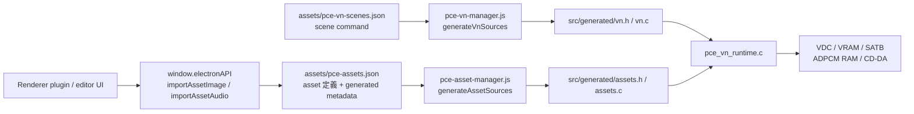
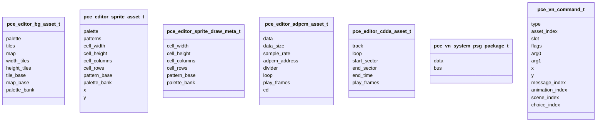
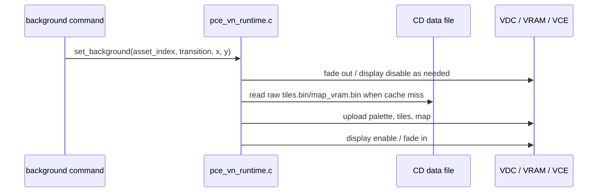
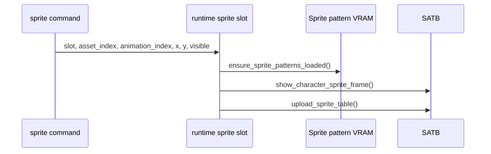
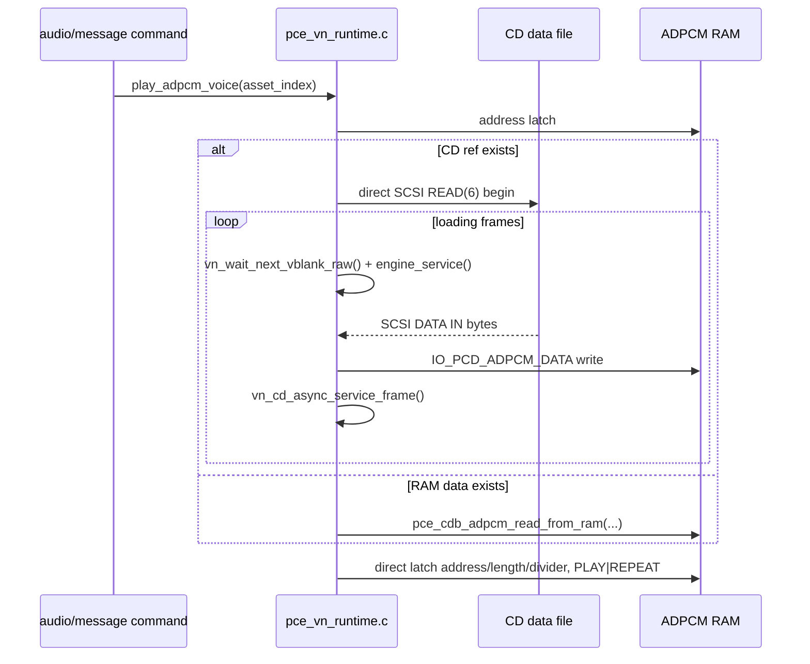
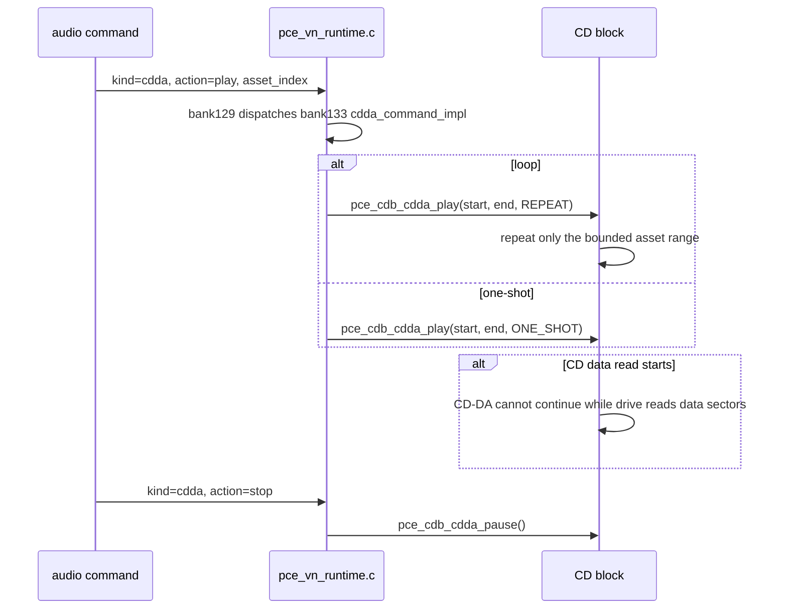

# PCE 画像・スプライト・音声・BIOS font プログラミングガイド

このガイドは、PCE Game Editor の現行実装における背景画像、スプライト表示、PSG、ADPCM、CD-DA、BIOS fontのAPIを、開発者が実装に使える形でまとめたものです。CD VNは日本版Super System Card 3.0 profile `jp-v3`を前提とし、PSGとfontにSystem Card BIOSを使います。HuCardのPSG/font形式は別実装です。

対象は PC Engine / Super CD-ROM2 project です。特に Visual Novel runtime (`template/template_pce_vn_cd/src/pce_vn_runtime.c`) と、そこへ渡される asset / scene 生成物を中心に説明します。

## API の全体像

現行 API は、1 つの高水準 C 関数を直接呼ぶ形ではなく、次の 5 層に分かれています。


```mermaid
flowchart LR
  A["Renderer plugin / editor UI"] --> B["window.electronAPI<br/>importAssetImage / importAssetAudio"]
  B --> C["assets/pce-assets.json<br/>asset 定義 + generated metadata"]
  D["assets/pce-vn-scenes.json<br/>scene command"] --> E["pce-vn-manager.js<br/>generateVnSources"]
  C --> F["pce-asset-manager.js<br/>generateAssetSources"]
  E --> G["src/generated/vn.h / vn.c"]
  F --> H["src/generated/assets.h / assets.c"]
  G --> I["pce_vn_runtime.c"]
  H --> I
  I --> J["VDC / VRAM / SATB<br/>ADPCM RAM / CD-DA"]
```

| 層 | 主なファイル/API | 役割 |
|---|---|---|
| Renderer IPC | `window.electronAPI.importAssetImage()` / `importAssetAudio()` / `listAssets()` | エディタや plugin から安全に asset を登録する |
| Asset schema | `assets/pce-assets.json` | 画像、スプライト、ADPCM、CD-DA の source/options/generated を保存する |
| Scene schema | `assets/pce-vn-scenes.json` | 背景表示、スプライト表示、音声再生を command として記述する |
| Generated C API | `src/generated/assets.h` / `vn.h` | runtime が参照する C struct / 配列へ変換する |
| Runtime | `src/pce_vn_runtime.c` | VRAM 転送、SATB 更新、ADPCM/CD-DA 再生を実行する |

## どの API を使うか

| やりたいこと | 登録 API | Asset type | Scene command | 生成 C struct | Runtime 側の主処理 |
|---|---|---|---|---|---|
| 背景画像を表示する | `importAssetImage({ kind: "background" })` | `image` | `background` | `pce_editor_bg_asset_t` | `set_background()` / `upload_bg_graphics()` |
| スプライトを表示する | `importAssetImage({ kind: "sprite" })` | `sprite` | `sprite` | `pce_editor_sprite_asset_t`, `pce_vn_sprite_anim_t` | `refresh_scene_sprites()` / `show_character_sprite_frame()` |
| 表示中スプライトを移動する | — | `sprite` | `spritemove` | 既存19-byte command record | DDA tick / SATB Y・X・pattern・attr更新 |
| ADPCM を鳴らす | `importAssetAudio({ kind: "adpcm" })` | `adpcm` | `audio` または `message.voiceAssetId` | `pce_editor_adpcm_asset_t` | `play_adpcm_voice()` / `stop_adpcm_voice()` |
| CD-DA を鳴らす | `importAssetAudio({ kind: "cdda-track" })` | `cdda-track` | `audio` | `pce_editor_cdda_asset_t` | `cdda_audio_command()` / `cdda_command_impl()` |
| PSG を鳴らす | PSG asset を登録 | `psg-song` / `psg-sfx` | `audio` (`kind: "psg"`) | `pce_vn_system_psg_package_t` (CD) | `system_psg_audio_command()` / System Card `PSG_DRIVE` |
| 入力で分岐する | — | — | `inputcheck` | `pce_vn_command_t` | メインループの sync/async 入力ウォッチャ + `jump_to_command()` |
| 短い文字をスプライトで重ねる | — | — | `spritetext` | Shift-JIS scene data | `EX_GETFNT` 12×12 / on-demand VRAM upload |

## Renderer IPC API

PC Engine project では、renderer から次の project-local IPC を使えます。

```js
const assets = await window.electronAPI.listAssets();

const bg = await window.electronAPI.importAssetImage({
  sourcePath: "/absolute/path/title.png",
  kind: "background",
  id: "title_bg",
  width: 224,
  height: 136
});

const sprite = await window.electronAPI.importAssetImage({
  sourcePath: "/absolute/path/akari.png",
  kind: "sprite",
  id: "akari_sprite",
  cellWidth: 16,
  cellHeight: 16
});

const voice = await window.electronAPI.importAssetAudio({
  sourcePath: "/absolute/path/voice.wav",
  kind: "adpcm",
  id: "voice_01",
  sampleRate: 8000,
  loop: false
});

const processedVoice = await audioConvertUi.openAudioConvertModal({
  mode: "pce-asset",
  returnResult: true,
  kind: "adpcm",
  picked: { sourcePath: "/absolute/path/voice.mp3", fileName: "voice.mp3", ext: ".mp3" },
  targetFileName: "voice_01.wav",
  defaults: { sampleRate: 8000, mono: true }
});

await window.electronAPI.importAssetAudio({
  dataUrl: processedVoice.dataUrl,
  sourceFileName: "voice_01.wav",
  originalFileName: processedVoice.originalFileName,
  processing: processedVoice.processing,
  splitPolicy: "auto",
  kind: "adpcm",
  id: "voice_01",
  sampleRate: processedVoice.processing.sampleRate
});

const cdda = await window.electronAPI.importAssetAudio({
  sourcePath: "/absolute/path/opening.wav",
  kind: "cdda-track",
  id: "opening_theme",
  track: 2,
  loop: false
});
```

| API | 戻り値の要点 | 注意 |
|---|---|---|
| `listAssets()` | `{ ok, file, assets }` | PC Engine core 専用 |
| `importAssetImage(payload)` | `{ ok, asset, assets, commandInfo, conversion }` | `sourcePath` は dialog 由来の絶対パス。保存先は project 相対に正規化 |
| `importAssetAudio(payload)` | `{ ok, asset, assets, conversion }` | WAV を ADPCM / CD-DA へ変換する。MP3 は `pce-audio-converter` の共通 UI で加工済み WAV Data URL にしてから渡す |
| `previewAssetSource(relativePath)` | `{ ok, dataUrl, mime, size }` | project root 内の相対パスのみ |
| `reorderAssets(ids)` | `{ ok, version, assets }` | `assets/pce-assets.json` の順序を保存 |
| `upsertAsset(asset)` / `deleteAsset(id)` | `{ ok, version, assets }` | 直接編集用。生成ファイル作成は import API が担当 |

`previewAssetSource()` と `reorderAssets()` は絶対パス、`..`、project root 外 escape を拒否します。`importAssetImage()` / `importAssetAudio()` の `sourcePath` は読み取り元として絶対パスを受けますが、保存される `source` と generated file path は project 相対です。`importAssetAudio()` に `dataUrl` を渡す場合は、その Data URL が project 内の `assets/adpcm/<id>.wav` または `assets/cdda/<id>.wav` として保存されます。

## Asset Schema

全 asset は `assets/pce-assets.json` に保存されます。

```jsonc
{
  "version": 2,
  "assets": [
    {
      "id": "title_bg",
      "type": "image",
      "name": "Title BG",
      "source": "assets/images/title_bg.png",
      "options": {},
      "data": {
        "generated": {},
        "import": {}
      }
    }
  ]
}
```

### 共通フィールド

| field | 型 | 説明 |
|---|---|---|
| `id` | `string` | scene command から参照する asset ID |
| `type` | `string` | `image`, `sprite`, `adpcm`, `cdda-track` など |
| `name` | `string` | UI 表示名 |
| `source` | `string` | project 相対の元ファイル |
| `options` | `object` | asset type ごとの設定 |
| `data.generated` | `object` | 変換済みファイル、サイズ、警告など |
| `data.import` | `object` | 元ファイル名、import 時刻、converter 名 |

### 背景画像 `image`

背景画像は 8x8 BG tile と BAT map に変換されます。CD-ROM2 target では、`tiles.bin` と `map_vram.bin` が CD data file として扱われます。**visual asset は常に無圧縮（raw）です** — 以前の RLE 圧縮と `options.compression` オプションは撤去しました（RLE デコーダが BG 破壊の原因になり overlay を圧迫したため）。
Image プラグインの BG 追加 UI では、作者が指定する変換条件は出力幅/高さだけです。既定値は標準 BG サイズの 224x136px で、`paletteBank` と `transparentIndex` は互換用 metadata として `0` を保持します。

```jsonc
{
  "id": "classroom_bg",
  "type": "image",
  "source": "assets/images/classroom_bg.png",
  "options": {
    "kind": "background",
    "paletteBank": 0,
    "tileBase": 128,
    "mapBase": 0,
    "x": 0,
    "y": 0,
    "width": 224,
    "height": 136,
    "cellWidth": 8,
    "cellHeight": 8,
    "transparentIndex": 0
  }
}
```

| option | 範囲/既定 | 説明 |
|---|---:|---|
| `kind` | `"background"` | `image` では background 固定 |
| `paletteBank` | 内部既定 `0` | BG palette bank。互換のため metadata には残るが、Image プラグインの BG 追加 UI では編集しない |
| `tileBase` | 自動 `128` | BG tile を置く tile index。32x32 BAT の後ろに自動配置され、UI では編集しない |
| `mapBase` | 自動 `0` | BAT map 転送先 word address。BG は左上から描画するため自動固定され、UI では編集しない |
| `x`, `y` | `0..255` | asset UI/preview 用の配置情報。VN runtime のBG表示位置は scene の `background` command 側の `x` / `y` で指定する |
| `width`, `height` | 既定 `224x136` | 画像サイズ。8px 単位推奨 |
| `cellWidth`, `cellHeight` | `8` | BG は 8x8 tile 固定 |
| `transparentIndex` | 内部既定 `0` | indexed/transparent 変換時の互換用 metadata。BG 表示では透明合成として使わないため UI では編集しない |

| generated field | 説明 |
|---|---|
| `paletteFile` | VCE color 16 色分の `palette.bin` |
| `tilesFile` | BG tile data `tiles.bin` |
| `mapFile` | compact map data |
| `mapVramFile` | CD-ROM2 VN runtime 用の32タイル幅ソース行 map |
| `tileCount` | 8x8 tile 数 |
| `vramBytes` | tiles + map の概算 VRAM byte 数 |
| `warnings` | VRAM overlap やサイズ警告 |

VN scene の `fullScreenBg: true` で使う 256x224 BG asset は、Full BG 専用で参照される場合に限り message/font用 VRAM との重なりを build error にしません。Full BG sceneでhardware spriteまたは`spritetext`を使う場合、buildはそのsceneで同時表示する固定SLOTのsprite pattern予約またはspritetext fontをFull BG tile末尾より後ろへ移動し、重なりを許可しません。通常sceneだけで使うsprite patternは低位へ残せるため、spritetext fontとの前後2順序を比較してSATB手前へpackします。runtimeはscene入場時に前sceneのsprite / SpriteText slotを消去し、そのscene内の`sprite` / `spritemove` / `spritetext`を通常どおり実行します。Full BG読み込み後はmessage/blank用VRAMをdirty扱いし、通常sceneへ戻る前または次の`message` / `choice`直前に復元します。同じBG assetを通常sceneの`background`でも参照する場合は、通常BGと同じ排他予約チェックが適用されます。

CD-ROM2 VN build の runtime asset metadata は scene command から参照された asset だけを `assets.c` へ出します。未使用 asset は Asset 一覧と generated file には残せますが、VRAM 排他予約、scene command index、resident bank128 予算には入りません。追加した素材を runtime で使うには、`background` / `sprite` / `message.voiceAssetId` / `audio` command などから参照してください。

### スプライト `sprite`

スプライトは PCE sprite pattern と sprite palette に変換されます。表示は VN scene の `sprite` command で行います。
Image プラグインの Sprites 追加 UI では、低レベルの `paletteBank` / `tileBase` / `x` / `y` / `transparentIndex` と初期 animation 設定は通常表示しません。追加時は `paletteBank: 0`、`tileBase: 704`、`x: 144`、`y: 104`、`transparentIndex: 0`、初期 animation `16x16` / `1 frame` / `1 frame delay` で登録し、frame size や ROW ごとの frame 数/time は Sprites タブのエディタ本体で編集します。変換時だけ有効な `cellWidth` / `cellHeight` は追加 modal の `アドバンス` に隠し、既存 asset では生成済み pattern とずれないよう通常の Properties からは編集しません。`tileBase` / `x` / `y` は有効な低レベル既定値として Properties の `アドバンス` に隠します。

> **重複セルの圧縮 (cell dedup)**: 変換時に sheet の表示 cell (`cellWidth` × `cellHeight`) を比較し、ユニークな cell block だけを `patterns.bin` へ出力します。16×16 cell は 128 byte の pattern 1 個、32×64 cell は 16×16 pattern 8 個が連続した block になります。positional display cell → ユニーク block slot の対応表を `cellmap.bin`(1 byte/cell) として生成し、`pce_editor_sprite_asset_t.cell_map` に resident 配列として埋め込みます。runtime の `show_character_sprite_frame()` がこの map 経由で frame の cell を VRAM slot へ解決するため、目パチ・口パクなど frame 間で共通する cell が 1 枚に畳まれ、多 frame の大きな sheet も VN の VRAM 予算に収まります。`tileCount` / `vramBytes` は dedupe 後の 16×16 pattern 数 / byte 数です。ユニーク block が 256 を超える sheet は build errorです。CD-ROM2 VN catalog は positional display cell も最大256件なので、幅×高さをcell単位へ換算した列数×行数が256を超えるsheetは分割するか、より大きいcell sizeを指定してください。

```jsonc
{
  "id": "akari_sprite",
  "type": "sprite",
  "source": "assets/sprites/akari_sprite.png",
  "options": {
    "kind": "sprite",
    "paletteBank": 0,
    "tileBase": 704,
    "x": 144,
    "y": 104,
    "width": 64,
    "height": 128,
    "cellWidth": 16,
    "cellHeight": 16,
    "transparentIndex": 0,
    "animations": [
      {
        "id": "default",
        "name": "待機",
        "frameWidth": 16,
        "frameHeight": 16,
        "firstCell": 0,
        "frameCount": 1,
        "frameDelay": 1,
        "frameStrideCells": 1,
        "loop": true
      }
    ]
  }
}
```

| option | 範囲/既定 | 説明 |
|---|---:|---|
| `paletteBank` | 既定 `0` | sprite palette bankの基準値。VN runtimeは`paletteBank + SLOT番号`をそのSLOTのpalette bankとして使い、別SLOTの差し替えで移動しない。Sprites追加UIでは編集しない |
| `tileBase` | 既定 `704` | C 生成後は `pattern_base`(32-word 単位)。非VN用途の低レベル既定値。VN runtime ではscene pathから各SLOTの最大容量を求め、`PCE_VN_SPRITE_SLOT0_PATTERN_BASE/CAPACITY`〜`SLOT3`の専用領域へ配置する。SLOT別最大容量の合計が`0x7f00`を超える構成はbuild error。通常 UI では隠し、Sprites Properties の `アドバンス` でのみ編集する |
| `x`, `y` | 既定 `144`, `104` | asset metadata 上の既定表示位置。scene command の `x`, `y` が実表示に使われる。通常 UI では隠し、Sprites Properties の `アドバンス` でのみ編集する |
| `width` | `0..1024` | sheet 全体の幅 |
| `height` | `0..2048` | sheet 全体の高さ |
| `cellWidth`, `cellHeight` | `16x16`, `16x32`, `16x64`, `32x16`, `32x32`, `32x64` | PCE sprite cell size。変換時の条件なので追加 modal の `アドバンス` だけで指定し、生成後は通常の Properties から編集しない |
| `transparentIndex` | 既定 `0` | 透明 index。追加 UI では編集しない |
| `animations` | 最大 16 件 | VN runtime 用 animation 定義 |

| animation field | 説明 |
|---|---|
| `id` | scene command の `animationId` で参照する ID |
| `name` | Animation Rows に表示する任意名（最大48文字）。変更しても `id` は変わらない |
| `frameWidth`, `frameHeight` | 1 frame の表示サイズ。cell size の倍数へ正規化 |
| `firstCell` | sheet 左上から数えた開始 cell index |
| `frameCount` | frame 数。最大 64 |
| `frameDelay` | 全 frame 共通の既定表示フレーム数。60fps基準で `1..65535` |
| `frameDelays` | 各 frame の表示フレーム数（長さ `frameCount`、各値 `1..65535`）。runtime は16-bitの `frame_delays[frame]` で frame ごとに送る。CD-ROM2ではtableをgenerated-data bank132に置き、tick直前にmapするため、animation数がbank128常駐領域を消費しない。空/未指定セルは `frameDelay` にフォールバック。スプライトエディタの time フィールド（`spriteEditor.time` 行列、1 行 = 1 animation）から保存・移行。`1000` は約16.67秒、上限は約18分12.25秒 |
| `frameStrideCells` | 次 frame まで何 cell 進むか |
| `loop` | 最終 frame 後に先頭へ戻すか |

VN runtime では `frameCount: 1` の default animation でも、`frameWidth` / `frameHeight` が sheet 範囲内ならその 1 frame 矩形を表示します。frame size 未指定の asset は generator が sheet 全体の 1 frame へ正規化します。口パク/目パチなど複数 frame を切り替えたい場合は、`frameCount > 1` とし、`frameWidth` / `frameHeight` / `frameStrideCells` が sheet cell 範囲内に収まるようにしてください。sprite pattern は常に無圧縮の `patterns.bin` を CD data file として使います（RLE は撤去）。

### ADPCM `adpcm`

ADPCM は WAV から `assets/generated/<id>/adpcm.bin` へ変換されます。CD-ROM2 target では CD data file として配置され、通常は runtime が ADPCM RAM へ読み込んでから再生します。生成される ADPCM は OKI/MSM5205 互換の 4-bit adaptive data の高位 nibble 先 (`msn-first`) です。旧 `pce-cd-adpcm-experimental`、古い `lsn-first`、nibble order 未記録、または `encoderVersion` が古い generated file は、source WAV が残っていれば build/source 生成時に自動再生成されます。WAV / MP3 の加工 UI は `pce-audio-converter` が提供し、trim、正規化、volume dB、fade in/out、波形 preview、seek、sample rate、mono/stereo を適用した WAV Data URL を `importAssetAudio()` に渡します。

```jsonc
{
  "id": "voice_01",
  "type": "adpcm",
  "source": "assets/adpcm/voice_01.wav",
  "options": {
    "sampleRate": 8000,
    "loop": false,
    "adpcmAddress": 0,
    "divider": 12
  }
}
```

| option | 範囲/既定 | 説明 |
|---|---:|---|
| `sampleRate` | `4000..32000`, 既定 `8000` | ADPCM 変換時の目標 sample rate。標準はCD読み込み量を抑えるため 8000Hz |
| `loop` | `false` | buffered 再生では repeat mode のまま runtime が停止 frame を管理し、loop 有効時は frame counter で再発行する |
| `adpcmAddress` | `0..65535` | ADPCM RAM 上の読み込み先 address |
| `divider` | `0..15`, 通常は自動 | ADPCM hardware に渡す ADPCM 再生 rate code。未指定時だけ `sampleRate` から自動計算する |

ADPCM の `divider` は音量ではなく再生速度です。PCE Game Editor は `divider` 未指定時に、`32000 / (16 - code)` が `sampleRate` に最も近い `0..15` の code を自動計算します。代表値は `32000Hz -> 15`, `16000Hz -> 14`, `8000Hz -> 12`, `4000Hz -> 8` です。`divider` を明示した場合は保存値をそのまま使い、runtime 側でも旧式値としての補正は行いません。

`splitPolicy: "auto"` を指定した ADPCM import では、変換後の ADPCM が direct-buffered 安全上限 `min(32767, 65536 - adpcmAddress)` bytes を超える場合に `<id>_part01`, `<id>_part02`, ... の複数 asset へ分割されます。各 part は独立した `adpcm` asset で、`data.import.groupId`, `partIndex`, `partCount`, `splitPolicy`, `maxAdpcmBytes` を持ちます。runtime 自動連結は行わないため、scene command や `message.voiceAssetId` では必要な part を個別に参照してください。

1 asset あたりの安定再生時間は、おおよそ `maxBytes * 2 / sampleRate` 秒です。`adpcmAddress: 0` の direct-buffered 上限 32767 bytes なら、16000Hz で約 4.09 秒、8000Hz で約 8.19 秒です。`adpcmAddress` を 32769 以上にすると `65536 - adpcmAddress` が先に効くため、その分だけ短くなります。

ADPCM は VN runtime / editor ともに buffered direct playback 専用です。buffered playback は System Card BIOS の `pce_cdb_adpcm_play()` を使わず、ADPCM read address / `0xffff` length / divider を直接 latch して repeat mode で開始します。通常は generated `play_frames` より数 frame 早く runtime が direct stop / loop restart します。CD unit IRQ と System Card pending latch は runtime 側で消し、BIOS の完了 IRQ path に戻さないことで、終端後の repeat wrap と PSG/VDC 停止を抑えます。ADPCM RAM への CD load は bank122 の direct SCSI async helper が SCSI DATA IN を `IO_PCD_ADPCM_DATA` へ書き、毎 frame `vn_wait_next_vblank_raw()` + `engine_service()` + `vn_cd_async_service_frame()` で進めます。この区間では System Card BIOS の `pce_cdb_adpcm_read_from_cd()`、external IRQ、`quiet_cd_unit_irqs()` を使わないため、PSG は実フレーム単位で進みます。`pce_cdb_adpcm_stream()` による true CD streaming は VN runtime 機能から削除済みです。長い message voice は `splitPolicy: "auto"` で direct-buffered 安全上限（既定 address では 32767 bytes）以下の part へ分けるか sample rate を下げ、buffered playback で再生してください。

ADPCM のノイズ原因を切り分ける場合は `samples/pce-adpcm-diagnostic` を使います。`node scripts/pce-adpcm-diagnostic.js analyze <source.wav> <adpcm.bin> <sampleRate>` は generated ADPCM を OKI/MSM5205 と旧実験形式、`lsn-first` / `msn-first` の各組み合わせで decode し、元 WAV との RMS error、SNR、correlation を表示します。`node scripts/pce-adpcm-diagnostic.js build` は VN runtime を通らず、System Card BIOS の `pce_cdb_adpcm_reset()` / `pce_cdb_adpcm_read_from_cd()` / `pce_cdb_adpcm_play()` だけを呼ぶ最小 CD-ROM2 ISO を生成します。

ADPCM 再生後の VN 進行確認は、標準 EmulatorJS/WASM だけで判断しないでください。Geargrafx / 外部エミュレーターで正常に message advance できる一方、標準 WASM の `mednafen_pce-wasm.data` だけ ADPCM 後に入力待ちから進まないケースがあります。この場合は、ADPCM command を抜いた比較 build、frame counter、`simulateInput()` 直接注入で入力経路を切り分け、Geargrafx で正常な runtime を標準 WASM 向けに壊す変更を入れないでください。特に「ADPCM 再生中に次 command へ進んだ」だけでは合格にせず、voice の自然終了後に次 message へ到達するかを ADPCMあり/なしの最小 scene で確認します。運用手順と再発防止チェックリストは `docs/pce-testplay-debugging.md` にまとめています。

### CD-DA `cdda-track`

CD-DA は WAV から `assets/generated/<id>/cdda.wav` へ正規化され、CD の audio track として bundle されます。MP3 入力の場合も renderer 側で加工済み WAV にしてから登録します。CD-DA は ADPCM のような自動分割を行いません。

```jsonc
{
  "id": "opening_theme",
  "type": "cdda-track",
  "source": "assets/cdda/opening_theme.wav",
  "options": {
    "track": 2,
    "loop": false
  }
}
```

| option | 範囲/既定 | 説明 |
|---|---:|---|
| `track` | `2..99`, 既定 `2` | CD-DA track 番号。track 1 は data track なので使わない |
| `loop` | `false` | `true` の場合、現行 VN runtime は `play_frames` 到達時に同じ track の再生命令を再発行する |

## Scene Command API

Visual Novel project では `assets/pce-vn-scenes.json` の `commands` が表示/再生のプログラミング API です。

```jsonc
{
  "version": 2,
  "settings": { "messageSpeedFrames": 10, "messageAdvanceMode": "button", "messageAutoWaitFrames": 60 },
  "startScene": "opening",
  "scenes": [
    {
      "id": "opening",
      "commands": [
        { "type": "background", "assetId": "classroom_bg", "transition": "fade", "fadeOutFrames": 30, "fadeInFrames": 30, "x": 2, "y": 1 },
        { "type": "sprite", "slot": 0, "assetId": "akari_sprite", "x": 128, "y": 24, "animationId": "default", "flipX": false, "flipY": false, "visible": true },
        { "type": "effect", "effect": "shake", "frames": 20, "intensity": 6 },
        { "type": "audio", "kind": "cdda", "action": "play", "assetId": "opening_theme" },
        { "type": "variable", "variableName": "route", "operation": "define", "value": 0 },
        { "type": "message", "speaker": "アカリ", "text": "こんにちは", "voiceAssetId": "voice_01" },
        { "type": "choice", "variableName": "route", "choices": [{ "label": "進む", "value": 1 }, { "label": "待つ", "value": 2 }] },
        { "type": "if", "variableName": "route", "operator": "eq", "value": 1, "targetLabel": "go_next", "elseLabel": "stay" },
        { "type": "label", "name": "go_next" },
        { "type": "goto", "targetLabel": "after_branch" },
        { "type": "label", "name": "stay" },
        { "type": "switch", "variableName": "route", "cases": [{ "value": 2, "targetLabel": "stay" }], "defaultLabel": "after_branch" },
        { "type": "label", "name": "after_branch" },
        { "type": "audio", "kind": "adpcm", "action": "stop", "assetId": "" }
      ],
      "nextSceneId": ""
    }
  ]
}
```

### 背景表示 command

```jsonc
{ "type": "background", "assetId": "classroom_bg", "transition": "fade", "fadeOutFrames": 30, "fadeInFrames": 30, "x": 2, "y": 1 }
```

| field | 値 | 説明 |
|---|---|---|
| `type` | `"background"` | 背景切替 |
| `assetId` | `image` asset ID | 無効な ID は最初の `image` asset へ fallback される |
| `transition` | `"fade"` | 互換用フィールド。エディタは Fade 前提で `cut` を表示しない |
| `fadeOutFrames` | `10 / 20 / 30 / 40 / 50 / 60` | 現背景を暗転する frame 数。エディタでは速度1(速い)〜速度6(遅い)のリストから選ぶ。未指定時は速度3の `30` |
| `fadeInFrames` | `10 / 20 / 30 / 40 / 50 / 60` | 次背景を表示する frame 数。エディタでは速度1(速い)〜速度6(遅い)のリストから選ぶ。未指定時は速度3の `30` |
| `x`, `y` | `0..31` / `0..31` | 32x32 BAT 上の描画開始タイル座標。未指定時は通常 BG 向けの `(2, 1)` |

CD-ROM2 VN runtime の `background` command は同期 command です。BG 切替は Fade 前提で、保存済みの旧 `transition: "cut"` は読み込み時に `transition: "fade"` へ正規化され、フレーム値も上記プリセットへ丸められます。BG の VRAM/BAT 転送と fade 完了が終わってから次 command へ進みます。fade は BG palette bank だけを段階変更し、メッセージ UI palette までは暗転させません。

### スプライト表示 command

```jsonc
{ "type": "sprite", "slot": 0, "assetId": "akari_sprite", "x": 128, "y": 24, "animationId": "default", "flipX": false, "flipY": false, "visible": true }
```

| field | 値 | 説明 |
|---|---|---|
| `type` | `"sprite"` | sprite slot の表示状態を更新 |
| `slot` | `0..3` | VN runtime の論理 slot。最大 4 slot を同時保持し、同じ slot への再指定で差し替え/非表示。`message.mouthSlot` が参照する |
| `assetId` | `sprite` asset ID | `visible: true` で無効な ID の場合 command 自体が正規化で除外される |
| `x`, `y` | `0..319`, `0..223` | 画面座標。runtime は PCE SATB 用に `x + 32`, `y + 64` へ補正 |
| `animationId` | animation ID | 未指定時は `default` |
| `flipX`, `flipY` | `boolean` | sprite pattern の描画向きを水平/垂直反転する |
| `visible` | `boolean` | `false` なら slot を非表示にする |

`sprite` command も同期 command です。表示・差し替え・非表示は指定座標へ即時反映されます。旧 `durationFrames` / `moveFrames` は読み込み時に破棄され、生成には使われません。立ち絵SLOTは`0`〜`3`を使用でき、各SLOTのsprite patternはscene path解析で求めた最大容量の専用VRAM範囲、paletteは`asset paletteBank + SLOT番号`へ固定されます。通常はBG tile 64〜539 の直後にメッセージstrip / blank / glyph mask / spritetext fontを詰め、その後ろからSATB手前までをSLOT別pattern領域として使います。Full BG上でSpriteTextだけを使う構成では、通常scene用sprite patternを先、Full BG末尾以降のspritetext fontを後にする順序も比較し、より低いhigh-water markへ自動packします。同一SLOTを別assetへ切り替えるときは、そのSLOTの旧SATB entryだけを一時的に画面外へ退避して専用pattern/paletteを更新します。sprite layer全体や別SLOTのSATB/pattern/paletteには触れないため、操作対象外の表示は維持されます。同じasset内の目パチ・口パクframe更新はpatternを再転送せず、既存SATB layoutのpattern wordだけを差分更新します。

### スプライト移動 command (`spritemove`)

```jsonc
{ "type": "spritemove", "slot": 0, "x": 224, "y": 24, "frames": 60, "async": false }
{ "type": "spritemove", "slot": 1, "x": 32, "y": 24, "frames": 60, "async": true, "animationAssetId": "mika_sprite", "animationId": "walk" }
```

| field | 値 | 説明 |
|---|---|---|
| `type` | `"spritemove"` | 表示中sprite slotを直線移動 |
| `slot` | `0..3` | 対象slot。非表示/未設定ならno-op |
| `x`, `y` | `0..319`, `0..223` | 移動先の画面座標 |
| `frames` | `1..65535` | 開始位置から目標位置までのVBlank数 |
| `async` | `boolean` | `false`（既定）は完了までscriptを停止。`true`は後続を実行し、別slotと同時移動可能 |
| `animationAssetId`, `animationId` | sprite ID / animation ID | 任意。移動開始時に同じ表示assetのanimationへ変更。asset不一致・未定義animationは位置付きbuild error |

command recordは19 bytesのままです。`frames`を`arg0/arg1`、移動先を`x/y`、非同期を`flags bit0`、任意animationを`asset_index/animation_index`へ格納します。runtimeは座標差と方向を保持する除算不要の整数DDAで補間します。CD版は最大4slot分のSATB entryを更新してから1回だけVBlankを待ち、System Card PSGのIRQ駆動を止めません。HuCard版も同じscene command契約です。同じslotへの新しい移動/表示、scene切替、`blank`で先行移動を中止します。Full BG sceneでも、そのscene内で表示したspriteへ使用できます。

### 演出 command

```jsonc
{ "type": "effect", "effect": "fadeOut", "frames": 16, "color": "#000000" }
{ "type": "effect", "effect": "fadeIn", "frames": 16 }
{ "type": "effect", "effect": "blank", "frames": 0 }
{ "type": "effect", "effect": "shake", "frames": 20, "intensity": 6 }
{ "type": "effect", "effect": "flash", "frames": 4, "color": "#ffffff" }
```

| field | 値 | 説明 |
|---|---|---|
| `type` | `"effect"` | 画面演出 command |
| `effect` | `"fadeOut"` / `"fadeIn"` / `"blank"` / `"shake"` / `"flash"` | 指定色へのフェードアウト、復帰、画面消去、画面シェイク、指定色フラッシュ |
| `frames` | `0..255` | fade / shake / flash の実行 frame 数。`blank` では保持されるが実行時間には使わない |
| `intensity` | `1..16` | `shake` の揺れ幅。`shake` 以外では `0` に正規化される |
| `color` | `#rrggbb` | `fadeOut` / `flash` の色。PCE 表示色（各チャンネル 3bit）へ丸めて command record の `x` に 9-bit GRB として格納する。未指定時は `fadeOut` が黒、`flash` が白 |

### スプライト文字オーバーレイ command (`spritetext`)

短い文字列を**ハードウェアスプライト**で BG / メッセージ UI の上に重ねて表示する command です。通常のメッセージ本文は BG タイルへ描画しますが、`spritetext` は「PRESS RUN BUTTON」のような演出用の短い文字を、BG の上に浮かせたり点滅させたりするために使います。

```jsonc
{ "type": "spritetext", "slot": 0, "text": "PRESS RUN BUTTON", "x": 64, "y": 184, "color": "#ffff00", "blinkFrames": 30, "visible": true }
{ "type": "spritetext", "slot": 0, "visible": false }
```

| field | 値 | 説明 |
|---|---|---|
| `type` | `"spritetext"` | スプライト文字オーバーレイ |
| `slot` | `0..3` | オーバーレイ slot。同じ slot への再指定で差し替え、`visible: false` で消去。最大 4 slot を同時保持 |
| `text` | 最大 64 文字 | 表示文字列。改行 `\n` で 2 行目以降へ送る。1 command あたり描画グリフ数は **32 まで**（改行も 1 つ消費）で、超過分は切り捨て |
| `x`, `y` | `0..319`, `0..223` | 左上の画面座標。runtime は PCE SATB 用に `x + 32`, `y + 64` へ補正し、`shake` 時は BG/sprite と同じ offset で揺れる |
| `color` | `#rrggbb` | 文字色。PCE 9bit GRB に丸めて表示。空欄は白 (`#ffffff`)。**同時表示時は 1 色**（後勝ち、後述） |
| `blinkFrames` | `0..255` | `0` で常時表示。`1` 以上で `blinkFrames` フレームごとに表示/非表示をトグル（点滅） |
| `visible` | `boolean` | `false` で slot を消去 |

CD VNの`spritetext`文字列はscene pack v3へ16-bit Shift-JISで格納されます。runtimeは表示に必要な文字だけをSystem Card `EX_GETFNT`の12×12 modeで取得し、2pxの透明余白を持つ16×16 hardware sprite patternへ4bpp化してVRAMへuploadします。見える字形と横ピッチはmessageと同じ12px、改行ピッチは16pxです。`font_sprite.bin`や起動時一括uploadはありません。HuCard VNのbanked sprite fontも同じ12×12字形・12pxピッチを使います。

制約（PCE ハードウェア由来）:

- スプライト文字は character sprite と同じ **64 entry の SATB / 1 走査線 16 スプライト**を共有します。見える字形は12x12・横12pxピッチですが、1文字につき透明余白付き16x16 hardware spriteを1個使うため、立ち絵と合わせて64 entry、同じ走査線で16個を超えないように短く保ってください。超過分は描画されません。
- 文字色は**予約スプライトパレットバンク** (`PCE_VN_FONT_SPRITE_PALETTE_BANK`、既定 15) の index 15 を runtime が書き換えて表現します。複数 slot を同時表示すると最後に描いた slot の色が全 slot に適用されます（同時に別色を出したい場合は表示タイミングをずらしてください）。スプライト asset の palette bank は既定 1 なので衝突しませんが、bank 15 を asset に割り当てている場合は避けてください。
- BIOS glyphのpatternはon-demand cacheへ置きます。cacheがSATBや通常sprite pattern領域と重なる配置はbuild errorです。
- 通常 sprite asset の pattern 領域も SATB (`0x7f00`) より手前に収めてください。`tileBase * 32 + patterns.bin / 2` が `0x7f00` を超える asset は warning になり、VN runtime では sprite 下部や SATB が壊れます。

点滅以外の表現（数フレームでフェード、移動など）は、`spritetext` の表示/非表示と既存の `wait` / `goto` / `inputcheck` を組み合わせて作れます。

### ADPCM 再生 command

```jsonc
{ "type": "audio", "kind": "adpcm", "action": "play", "assetId": "voice_01" }
{ "type": "audio", "kind": "adpcm", "action": "stop", "assetId": "" }
```

| field | 値 | 説明 |
|---|---|---|
| `type` | `"audio"` | 音声 command |
| `kind` | `"adpcm"` | ADPCM を対象にする |
| `action` | `"play"` / `"stop"` | 再生または停止 |
| `assetId` | `adpcm` asset ID | `play` のときだけ参照 |

`message` command の `voiceAssetId` でも ADPCM を再生できます。

```jsonc
{
  "type": "message",
  "text": "こんにちは",
  "textColor": "#ffdb00",
  "voiceAssetId": "voice_01"
}
```

`message.textColor` は本文色です。build 時に PCE 9bit GRB へ丸めた値を scene pack へ保存し、runtime は message 表示開始時に UI palette の前景色を書き換えます。エディタの VN プレビューも同じ `textColor` をメッセージ描画へ反映します。

`settings.messageSpeedFrames` は予約変数`MSG_SPEED=0`時の文字送り速度で、`0 / 10 / 20 / 30 / 40 / 50` のプリセット値へ正規化されます。`settings.messageAdvanceMode` は予約変数`AUTO_ENABLE`の初期値（`button=0`, `auto=1`）、`settings.messageAutoWaitFrames`は音声なしAUTOなどの待機時間です。個々の`message` commandの旧`textSpeedFrames` / `advanceMode` / `autoWaitFrames`は読み込み時に破棄されます。

`AUTO_ENABLE`と`MSG_SPEED`はCD-ROM2 / HuCARD共通の大文字・完全一致の予約変数で、Variable / Choice / IF / Switchから通常変数と同じように扱えます。`AUTO_ENABLE`は`0..1`、`MSG_SPEED`は`0..6`へ書き込み時にクランプされます。SELECTのpressed edgeはInput監視より先に消費して`AUTO_ENABLE`を反転し、SELECTはInput commandの対象外です。`MSG_SPEED=1..6`はメッセージ開始時に`0 / 10 / 20 / 30 / 40 / 50` frame/文字へスナップショットされ、表示中の変更は次のメッセージから反映されます。

`MSG_SPEED=0`かつ`voiceAssetId`にADPCMがある場合、VN source生成時に再生長から算出したscene packの`text_speed_frames`を使用します。再生長を確認できなければ`settings.messageSpeedFrames`へfallbackします。AUTOの音声なしMessageは本文完了後に`messageAutoWaitFrames`を待ちます。CD one-shot Message voiceは本文とADPCM自然終了の両方が完了した時点で追加待機なしに進み、自然終了時にstop/resetを追加しません。開始失敗とloop voiceはAuto waitを使い、loopは遷移時に明示停止します。独立Audio commandとHuCARDのPSGはAUTO完了条件へ含めません。`AUTO_ENABLE=0`で全文表示後は4行目末尾へ`▼`を点滅表示し、手動送りでは再生中voiceを停止します。

### PSG 再生 command

```jsonc
{ "type": "audio", "kind": "psg", "action": "play", "assetId": "chime", "channel": 0 }
{ "type": "audio", "kind": "psg", "action": "stop", "target": "bgm" }
{ "type": "audio", "kind": "psg", "action": "stop", "target": "all" }
```

| field | 値 | 説明 |
|---|---|---|
| `kind` | `"psg"` | PSG (`psg-song` / `psg-sfx`) asset を対象にする |
| `action` | `"play"` / `"stop"` | 再生または停止 |
| `assetId` | `psg-song` / `psg-sfx` asset ID | `play` のとき参照 |
| `channel` | `0..5`, 既定 `0` | 基準 PSG チャンネル |
| `target` | `"bgm"` / `"sfx"` / `"all"` | `stop`の対象。未指定は`all` |

CD VN buildはstep sourceをSystem Card track bytecodeへ変換します。`psg-song`はmain track/BGM、`psg-sfx`はsub track/SFXで、両方を同時再生できます。新しいplayは同じbusだけを置換します。再生時間はVSync user IRQが各VBlankで1回呼ぶ`PSG_DRIVE/$E0E1`だけで進み、main-thread sequencer、TIMER、credit、catch-upはありません。

packageは実際にsceneから参照された`(assetId, channel)`ごとに作ります。`channel` shift/clampはbuild時にvariantへ焼き込みます。長さはBPM規則からframeへ変換し、長いnoteはdirect-length分割+tie、song loopはSEGNO、SFX終端はend commandになります。tone periodをnote+detuneで正確に表現できない場合、noiseがchannel 4/5以外に配置される場合、容量を超える場合は位置付きbuild errorです。

CD packageはbank134 `$8024`以降のBGM（最大8156 bytes）とbank135 `$A000`以降のSFX（最大8192 bytes）へdirect async loadします。対象busだけを停止し、宣言byte数だけを転送するので、他方のbusは継続します。同じbusの再生中に別packageを`cache load`するscriptはvalidation errorです。

user waveformとして登録するのは32-byte squareの45だけで、外部envelope/FMは使いません。CD patternのoptional `wave`は0〜44をSystem Card内蔵wave、45をそのsquareとして発音ごとの`WAVE` commandへ変換します。MIDI取込はProgram ChangeをGM 16ファミリーへまとめ、`midiOptions.programWaveMap`で割り当てます。手入力、VGM、SFXデザイナーなど`wave`未指定のtoneは45です。`options.volume`のbuild-time scaleも従来どおり利用できます。WebAudio previewは内蔵waveの大まかなスペクトル分類であり、最終音色はGeargrafx/実機で確認します。

HuCARD VN build は System Card package へは変換しませんが、共通の 8-byte step の byte 7 に `wave`を保持します。System Card ROM の波形表は利用できないため、0〜45 を preview と同じ sine / saw / triangle / square の4分類へ近似し、HuCARD runtime が32-sample waveを生成します。CD版と波形のスペクトルは完全一致しませんが、MIDI再変換後の音色割り当てがすべて矩形波へ失われることはありません。song/BGMとSFXは別busとして管理し、同じ物理channelでは発音中のSFXを優先して、終了時にBGMを復元します。`stop`の`bgm` / `sfx` / `all`もHuCARD側で区別します。

### CD-DA 再生 command

```jsonc
{ "type": "audio", "kind": "cdda", "action": "play", "assetId": "opening_theme" }
{ "type": "audio", "kind": "cdda", "action": "stop", "assetId": "" }
```

| field | 値 | 説明 |
|---|---|---|
| `kind` | `"cdda"` | CD-DA track を対象にする |
| `action` | `"play"` / `"stop"` | `play` は track 再生、`stop` は pause |
| `assetId` | `cdda-track` asset ID | `play` のとき `options.track` が runtime へ渡る |

現行 VN runtime の CD-DA 再生は、明示的な audio command がある場合だけ開始します。asset 生成時に `start_sector` と、次track先頭（最終trackではlead-out）を指す排他的 `end_sector` をcatalogへ保存し、両方を `PCE_CDB_LOCATION_TYPE_SECTOR` として `pce_cdb_cdda_play()` へ渡します。`cdda-track.options.loop` が `true` ならこの範囲へ `PCE_CDB_CDDA_PLAY_REPEAT`、`false` なら `PCE_CDB_CDDA_PLAY_ONE_SHOT` を指定するため、選択trackを越えて後続trackへ流れません。CD VNはgraphics/full VBlank handlerを使わず、generic IRQ user vectorでVDC statusをackして`PSG_DRIVE`を1回実行します。CD-DA play後はCD/IRQ stateだけを同期し、VDC/VCEを再初期化しません。CD data / ADPCM BIOS helper後にfull video復元が必要な場合は、まずR5とuser IRQを再設定して次VBlankを待ち、blank中にVCE・R9〜R14・R19・scrollを復元してから表示を再開します。可視走査中に同じtiming値を書き直して1frameの同期崩れを起こさないための順序です。

### 読み込みと cache

明示的な `preload` command は廃止済みです。scene 入場時の runtime は、scene pack v3をbank123のactive cache（8192 bytes）へ読み込んでから、最初の `message` / `choice` / `wait` / `jump` までに必要なassetだけを先読みします。scene readerはoffset/countでbank123へ短時間mapし、message開始時には最大68 glyphをconsole RAMへdetachします。scene後半の背景・sprite・ADPCMは必要になった時点で読み込みます。script pack読込はCD data readなのでCD-DAと同時には行えません。

現行 runtime は ADPCM の cache 状態を `loaded_adpcm_valid` / `loaded_adpcm_index` で管理します。build は `message.voiceAssetId` に必要な内部 `Cache Load ADPCM` を挿入し、分岐やADPCM cache操作より前にある最初の message voice については scene 先頭へ hoist します。同じscene内で別ADPCMの message voice が続く場合は、そのmessage直前でADPCM RAMを読み替えます。実際の `audio` / `message.voiceAssetId` 再生時に必要な ADPCM を読み込み、すでに同じ ADPCM が読み込まれている場合は controller を reset/load しません。音声の確実な再生制御は `audio` command または `message.voiceAssetId` を主 API にしてください。

`cache` command は runtime cache の invalidation と、明示 asset load を扱います。`action: "clear"` は読み込み済み判定だけを落とします。

```jsonc
{ "type": "cache", "action": "clear", "scope": "visual" }
```

`scope` は `visual`（BG + Sprite）/ `bg` / `sprite` / `adpcm` / `psg` / `all` です。`psg`はBGM/SFXそれぞれのloaded package keyだけを落とし、再生自体は停止しません。`all`はvisual + ADPCM + PSGに加えてBIOS message glyph cacheを無効化します。いずれも現在のVRAM / BAT / SATB / ADPCM controller / CD-DA / PSG / scene pack / 変数には触れない非破壊操作です。

明示 load は同じ `cache` command の `action: "load"` を使います。対象は1 commandにつき1 assetです。`scope: "adpcm"`はADPCM停止中だけADPCM RAMへ読み込みます。`scope: "psg"`は参照commandの`(assetId, channel)` packageをbus別bankへ先読みします。同じbusが再生中の別packageをpreloadするsceneはbuild時に拒否されます。`scope: "bg"`はBG tiles/map、`scope: "sprite"`はsprite patternをvisual cacheへ読み込み、表示状態は変えません。

PSGの途切れ/倍速はcredit調整で直しません。Geargrafxで`PSG_DRIVE/$E0E1`が各VBlank 1回だけ通ること、full handler`$E873`が0回であること、package load中もIRQ epochが進むことを確認します。BGM loadはbank134、SFX loadはbank135だけを更新し、ISR前後のMPR4/5/6が一致しなければBIOS adapter/bank復帰の不具合です。

HuCARD VN では HuC6280 TIMER IRQ を PSG の時間源にしません。TIMER credit 実験では main thread の VBlank service と独立した credit が積まれ、通常時の高速再生や不安定な catch-up を起こしやすかったため、HuCARD 側は `wait_vblank()` 直後の cooperative service point で `psg_advance(1)` する方式を標準にします。PSG register / VDC / bank 切替は main thread の安全地点でのみ行います。HuCARD 側で PSG slowdown を調査する場合は、PSG register write の間隔、`IRQ_VDC` が mask のままか、長い `copy_data_ref_to_vram_guarded()` の slice 間で VBlank service が挟まっているかを確認してください。

### 変数と分岐 command

```jsonc
{ "type": "variable", "variableName": "score", "operation": "define", "value": 0 }
{ "type": "variable", "variableName": "score", "operation": "add", "value": 1 }
{ "type": "variable", "variableName": "roll", "operation": "random", "min": 1, "max": 6 }
```

| field | 値 | 説明 |
|---|---|---|
| `type` | `"variable"` | runtime 変数を操作する |
| `variableName` | ID | build 時に小さな index へ変換される変数名 |
| `operation` | `"define"` / `"set"` / `"add"` / `"sub"` / `"random"` | 初期定義、代入、加算、減算、範囲ランダム |
| `value` | signed 16-bit | `define` / `set` / `add` / `sub` で使う値 |
| `min`, `max` | signed 16-bit | `random` の範囲 |

```jsonc
{
  "type": "choice",
  "variableName": "route",
  "defaultIndex": 0,
  "choices": [
    { "label": "進む", "value": 1 },
    { "label": "待つ", "value": 2, "targetSceneId": "opening" }
  ]
}
```

`choice.variableName` が指定されている場合、I/II/RUN で確定した選択肢の `value` を変数へ代入します。`targetSceneId` は従来互換の scene 遷移として残っており、未指定なら同じ scene の次 command へ進みます。

```jsonc
{ "type": "label", "name": "route_a" }
{ "type": "if", "variableName": "route", "operator": "eq", "value": 1, "targetLabel": "route_a", "elseLabel": "route_b" }
{ "type": "switch", "variableName": "route", "cases": [{ "value": 1, "targetLabel": "route_a" }], "defaultLabel": "route_b" }
{ "type": "goto", "targetLabel": "route_a" }
```

`label` は同一 scene 内の分岐先を定義する no-op command です。`if` は `eq` / `ne` / `lt` / `lte` / `gt` / `gte` で比較し、条件成立時に `targetLabel`、不成立時に `elseLabel` へ command pointer を移動します。`switch.cases` は増減可能で、最初に一致した `value` の `targetLabel` へ移動し、一致しない場合は `defaultLabel` へ移動します。`goto` は指定 label へ無条件移動します。表示待ちのないGOTOループで実機を固めないよう、runtime は1回の advance あたり1024 commandで1 frame待つガードを持ちます。

```jsonc
{ "type": "inputcheck", "mode": "sync",   "buttons": ["i", "right"], "targetLabel": "go_next" }
{ "type": "inputcheck", "mode": "async",  "buttons": ["ii"],         "targetLabel": "skip" }
{ "type": "inputcheck", "mode": "cancel" }
```

`inputcheck` は指定ボタンの入力で同一 scene 内の `targetLabel` へ GOTO する分岐 command です。`buttons` は `up` / `down` / `left` / `right` / `run` / `i` / `ii` の OR 条件（コンパクトなトグル UI で指定）。SELECTは`AUTO_ENABLE`切り替え専用です。`mode` は 3 種です。

| mode | 動作 |
|---|---|
| `sync` | 条件入力があるまで同期待機し、入力が来たら `targetLabel` へ GOTO する |
| `async` | 待機状態を保持したまま次 command へ進み、以後どのフレームでも条件成立で `targetLabel` へ GOTO する |
| `cancel` | 保持中の非同期待機を終了する |

非同期待機は単一ウォッチャ（同時に 1 つ）で、scene 切替時に自動でクリアされます。ボタンマスクは command record の `arg0`、`mode` は `flags`、移動先 label index は `x` に格納します。

## Generated C API

Build 時に `pce-asset-manager.js` と `pce-vn-manager.js` が `src/generated/assets.h` / `assets.c` / `vn.h` / `vn.c` を生成します。


```mermaid
classDiagram
  class pce_editor_bg_asset_t {
    palette
    tiles
    map
    width_tiles
    height_tiles
    tile_base
    map_base
    palette_bank
  }
  class pce_editor_sprite_asset_t {
    palette
    patterns
    cell_width
    cell_height
    cell_columns
    cell_rows
    pattern_base
    palette_bank
    x
    y
  }
  class pce_editor_sprite_draw_meta_t {
    cell_width
    cell_height
    cell_columns
    cell_rows
    pattern_base
    palette_bank
  }
  class pce_editor_adpcm_asset_t {
    data
    data_size
    sample_rate
    adpcm_address
    divider
    loop
    play_frames
    cd
  }
  class pce_editor_cdda_asset_t {
    track
    loop
    start_sector
    end_sector
    end_time
    play_frames
  }
  class pce_vn_system_psg_package_t {
    data
    bus
  }
  class pce_vn_command_t {
    type
    asset_index
    slot
    flags
    arg0
    arg1
    x
    y
    message_index
    animation_index
    scene_index
    choice_index
  }
```

| C symbol | 内容 |
|---|---|
| `pce_editor_bg_assets[]` / `_count` | `image` asset の generated palette/tile/map metadata |
| `pce_editor_sprite_assets[]` / `_count` | `sprite` asset の generated palette/pattern metadata |
| `pce_editor_sprite_draw_meta[]` | sprite SATB 構築用の compact metadata。CD runtime は共有状態へコピーせず、asset descriptor とSLOT割り当てから必要フィールドをslotごとのローカル値へスナップショットして使う |
| `pce_editor_adpcm_assets[]` / `_count` | `adpcm` asset の data size, address, divider, loop, play_frames, CD sector metadata |
| `pce_editor_cdda_assets[]` / `_count` | `cdda-track` asset の track/loop metadata |
| `pce_vn_system_psg_packages[]` / `_count` | CD VNで参照された`(assetId, channel)`ごとのSystem Card package CD refとmain/sub bus |
| `pce_vn_sprite_animations[]` / `_count` | `sprite.options.animations` を cell 単位へ正規化した metadata |
| `pce_vn_scene_packs[]` / `_count` | scene pack の CD sector、sector count、byte size、next scene |
| `pce_vn_variable_initial_values[]` / `_count` | runtime 変数の初期値 |

`voice_index`、`asset_index`、`message_index`、`animation_index`、`scene_index`、`choice_index`、`target_scene`、`variable_index`、`next_scene` は `-1` sentinel を持つため `signed int` として生成します。scene 数、variable 数、sprite animation 数は `unsigned char` で公開するため build 時に 255 件を上限として検証します。CD-ROM2 VN の command/message/choice/switch は scene pack 内の local index になり、上限は scene ごとに 255 件です。CD scene pack v3は8192 bytes以下、HuCard scene pack v2は4096 bytes以下です。

PCE-CD / Super CD-ROM2 buildではbank123をscene pack、bank128/129/130をresident code、bank132をgenerated data/scratch/変換済みglyph cache、bank133をcode overlay、bank134をSystem Card BGM、bank135をSystem Card SFXに使います。bank131はSystem Cardのため使用禁止です。message/spritetext glyphは`EX_GETFNT`からon-demand取得し、`font.bin`/`font_sprite.bin`を生成しません。CD textはlength付き16-bit Shift-JISで、ASCIIは全角化し、非漢字領域+JIS第一水準以外をbuild errorにします。詳細とlink-map gateは`docs/pce-memory-bank-strategy.md`を参照してください。

VN sprite runtime はsprite descriptorとSLOT割当をruntime-owned snapshotへ落としてからSATBを組みます。未使用SATB entryは`VN_SPRITE_HIDDEN_Y`へ逃がします。ADPCM再生中もsprite/spritetext/口パクを更新します。VDC accessはIRQ lockでSystem Card VSync handlerとの再入を防ぎ、SATB DMA/R5/R7/R8等の更新はVBlank側へ寄せます。PSGのframe進行はmain threadからserviceせず、VSync IRQの`PSG_DRIVE`だけが担当します。VDC memory controlは`VN_VDC_MEMORY_CONTROL` (`VDC_CYCLE_4_SLOTS | VDC_BG_SIZE_32_32`)を使います。

CD-ROM2 VN runtime は `map_vram.bin` を `mapBase` から丸ごとVRAMへ置くblobとして扱いません。raw `map_vram.bin`（無圧縮）は1行32タイルのソースとしてCDから読み、各行の `width_tiles` 分だけを `mapBase + command.y * 32 + command.x + row * 32` にコピーします。これにより、背景画像より広い画面領域の左右/上下余白は blank tile のまま残り、CD map paddingの0 wordが古いVRAM tileを参照して縦縞になる事故を防ぎます。BG command の fade は BG palette bank だけを暗く/明るくし、display layer 全体を無効化しないため、メッセージ UI palette までは暗転しません。UI も含めて指定色へ落としたい場合は `effect: "fadeOut"` と `color` を使います。

`pce_vn_runtime.c` 内の `set_background()`、`play_adpcm_voice()` などは現状 `static` な内部実装です。外部 plugin や game code から直接呼ぶ公開 C API ではなく、公開面は scene JSON と generated C struct / 配列です。

## Runtime の動き

### 背景画像


```mermaid
sequenceDiagram
  participant Scene as background command
  participant RT as pce_vn_runtime.c
  participant CD as CD data file
  participant VDC as VDC / VRAM / VCE
  Scene->>RT: set_background(asset_index, transition, x, y)
  RT->>VDC: fade out / display disable as needed
  RT->>CD: read raw tiles.bin/map_vram.bin when cache miss
  RT->>VDC: upload palette, tiles, map
  RT->>VDC: display enable / fade in
```

背景は `upload_bg_graphics()` で palette、tiles、map を転送します。BG map は `VN_MAP_WIDTH = 32` の BAT として扱われます。CD-ROM2 target では raw data sector を 1 セクタずつ `cd_transfer_scratch` へ読み込み、CD read 完了後に CD-DA を再開してから、resident/noinline かつ IRQ guard 付きの `pce_editor_vram_copy()` で VRAM へ転送します。この helper の RAM→VDC data port 転送は HuC6280 の TIA block transfer です。PSG 再生中は約32 byte sliceで cooperative service を挟み、PSG が鳴っていない場合は最大 1 sector までまとめて転送します。full-width BG map は行ごとの copy ではなく連続 BAT copy にできます。BAT 行更新を行う `write_map_words()` も同じ helper を通ります（visual asset は常に無圧縮。RLE は撤去）。

### スプライト


```mermaid
sequenceDiagram
  participant Scene as sprite command
  participant RT as runtime sprite slot
  participant VRAM as Sprite pattern VRAM
  participant SATB as SATB
  Scene->>RT: slot, asset_index, animation_index, x, y, visible
  RT->>VRAM: ensure_sprite_patterns_loaded()
  RT->>SATB: show_character_sprite_frame()
  RT->>SATB: upload_sprite_table()
```

runtime は 4 つの論理 sprite slot を持ちます。1 slot の animation frame は `frameWidth` / `frameHeight` に応じて複数の hardware sprite entry を消費します。SATB 全体は 64 entry です。buildはscene path全体を解析し、各SLOTに登場する最大asset容量をそのSLOT専用のpattern VRAMとして固定予約します。palette bankも`asset paletteBank + SLOT番号`へ固定され、各SLOTのSATBはその専用base/bankを参照します。通常BGが224x136px以内に収まるVN sceneでは、VRAMはBG(64〜539) → message/spritetext → SLOT0〜SLOT3のsprite patternsの順に配置します。SLOTに空きがあっても後続SLOTのbase/bankは切替時に移動しません。buildはSLOT別最大pattern容量の合計がSATB領域へ食い込む場合やpalette bankが予約bankへ届く場合はerrorにします。

### ADPCM


```mermaid
sequenceDiagram
  participant Scene as audio/message command
  participant RT as pce_vn_runtime.c
  participant CD as CD data file
  participant AD as ADPCM RAM
  Scene->>RT: play_adpcm_voice(asset_index)
  RT->>AD: address latch
  alt CD ref exists
    RT->>CD: direct SCSI READ(6) begin
    loop loading frames
      RT->>RT: vn_wait_next_vblank_raw() + engine_service()
      CD-->>RT: SCSI DATA IN bytes
      RT->>AD: IO_PCD_ADPCM_DATA write
      RT->>RT: vn_cd_async_service_frame()
    end
  else RAM data exists
    RT->>AD: pce_cdb_adpcm_read_from_ram(...)
  end
  RT->>AD: direct latch address/length/divider, PLAY|REPEAT
```

buffered playback の停止は ADPCM hardware の PLAY bit を直接落とします。VN runtime は true CD streaming 経路を使いません。

CD-ROM2 runtime は CD 上の ADPCM payload を bank122 の direct SCSI async helper で ADPCM RAM へ読み込みます。direct-buffered 安全上限に収まる buffered asset は、その後の再生開始と停止を ADPCM hardware への direct latch / direct stop で行います。安全上限を超える voice は `splitPolicy: "auto"` や sample rate 低下で分割し、runtime で true streaming へ fallback しません。

ADPCM RAM への CD 読み込み中は `vn_wait_next_vblank_raw()` + `engine_service()` + `vn_cd_async_service_frame()` を毎 frame 実行し、SCSI DATA IN を `IO_PCD_ADPCM_DATA` へ直接書きます。この区間はSystem Card CD/ADPCM BIOS helperやCD external IRQを使いませんが、VSync user IRQは動作し続け、`PSG_DRIVE`が実フレームで進みます。buffered playbackではdirect latchで再生を開始します。非loop playbackはBIOS stopped bitを毎frame監視せず、generated `play_frames`で自然終了を管理します。自然終了後に追加の`pce_cdb_adpcm_stop()` / `pce_cdb_adpcm_reset()`は発行しません。ADPCM再生開始後のjoypad baselineには現在押されているbuttonを使い、押しっぱなしを新規edgeにしません。
Generated C の `data_size` は `unsigned long` field として出力し、長尺 ADPCM でも llvm-mos の16bit `unsigned int` literal に丸められないようにします。

ADPCM 後の進行停止を直す場合は、`docs/pce-testplay-debugging.md` の「標準 WASM だけ ADPCM 後に進まない場合」を先に確認してください。command scheduler、joypad edge、ADPCM 完了IRQによる CPU 停止は見た目が似ているため、入力なしで完了後の next message へ進む最小 scene と、`voiceAssetId` を外した対照 build の両方を標準 WASM core で確認してから runtime を変更します。

### CD-DA


```mermaid
sequenceDiagram
  participant Scene as audio command
  participant RT as pce_vn_runtime.c
  participant CDB as CD block
  Scene->>RT: kind=cdda, action=play, asset_index
  RT->>RT: bank129 dispatches bank133 cdda_command_impl
  alt loop
    RT->>CDB: pce_cdb_cdda_play(start, end, REPEAT)
    CDB->>CDB: repeat only the bounded asset range
  else one-shot
    RT->>CDB: pce_cdb_cdda_play(start, end, ONE_SHOT)
  end
  alt CD data read starts
    CDB->>CDB: CD-DA cannot continue while drive reads data sectors
  end
  Scene->>RT: kind=cdda, action=stop
  RT->>CDB: pce_cdb_cdda_pause()
```

CD-DA は `cdda-track.options.track` 順で CUE に並べられ、asset 生成時に各trackの絶対開始sectorと排他的終了sectorがcatalog recordへ保存されます。現行 runtime では track が 2 未満なら再生しません。再生開始時に古い CD-DA があれば `pce_cdb_cdda_pause()` で止め、開始・終了とも `PCE_CDB_LOCATION_TYPE_SECTOR` を指定して `pce_cdb_cdda_play()` を呼びます。track番号やtime addressingは、track 3指定時にtrack 2から流れたりGearGrafx上でPLAYINGへ遷移しなかったりするケースがあったため使いません。また `UNTIL_END` は選択track以後の全audio trackを範囲に含めるため使わず、SubQ pollingも再生をIRQ stopさせることがあったため使いません。CD-DA BIOS playはVDC/VCE stateを変更しないため、play直後に`pce_vdc_set_resolution()`を呼びません。同値でも可視走査中のVCE/R9〜R14再書込みは内部sync phaseを乱すためです。

CD-DA の play/stop command 本体はbank133 overlayに置き、bank129には薄いdispatchだけを残します。System Card repeat modeは範囲指定なしの `UNTIL_END` と組み合わせるとディスク末尾までを繰り返しますが、現行runtimeはgeneratedの排他的end sectorを渡すため、同じmodeで選択assetだけを反復できます。境界でpause/playを再発行するVBlank serviceは使いません。CD-DA は data read と同じ CD drive を使うため、BG / sprite / ADPCM / scene pack などの CD data file 読み込み中に継続再生はできません。現行既定では `VN_CDDA_RESUME_AFTER_DATA_READ 0` として、CD data read 前にCD-DAをpauseして停止扱いにしますが、自動resume管理は常駐 bank へ載せません。ロード中にも音楽を維持したい場合は PSG BGM を使います。

## 音量とフェード

ADPCM / CD-DA の任意 volume 値を asset や scene command から直接指定する runtime API は、現行実装にはありません。`pce-audio-converter` の volume / normalize / fade は import 時に WAV 波形へ焼き込まれる加工です。

CD BIOS には `pce_cdb_fader()` があり、CD-DA 側は `PCE_CDB_FADER_PCM_2_5_SEC` / `PCE_CDB_FADER_PCM_6_SEC`、ADPCM 側は `PCE_CDB_FADER_ADPCM_2_5_SEC` / `PCE_CDB_FADER_ADPCM_6_SEC` を選べます。これは任意音量のミキサーというより、CD unit の fader mode を起動する API です。フェードアウト用途は追加しやすい一方で、フレーム単位の volume curve や汎用 fade-in は現行 scene API だけでは表現できません。

ADPCM の `divider` は再生周波数/速度側の値で、音量ではありません。

## スプライトのフェード

背景 fade は `fade_palette()` が BG palette bank を段階的に暗く/明るくすることで実現しています。スプライトは VCE の sprite palette 領域 (`256 + paletteBank * 16`) を使うため、現行 runtime の背景 fade だけでは一緒にフェードしません。BG command 単体では display layer 全体を落とさないため、メッセージ表示中にBGを切り替えても UI palette は巻き込まれません。

スプライト fade 自体は palette fade と同じ考え方で実装可能です。visible slot の `pce_editor_sprite_asset_t.palette` を集め、sprite palette 領域に対して `fade_palette()` 相当の処理を行えば、立ち絵を背景と同じように暗転できます。ただし現行 API には sprite command ごとの `transition` や `fadeFrames` はまだありません。

## 実装レシピ

### 背景を追加して表示する

1. `importAssetImage({ kind: "background", id: "classroom_bg", ... })` で登録する。
2. `assets/pce-vn-scenes.json` の command に `{ "type": "background", "assetId": "classroom_bg" }` を追加する。
3. build 時に `pce_editor_bg_assets[]` と scene pack / `pce_vn_scene_packs[]` が生成される。
4. runtime が command 実行時に VRAM と palette を転送する。

### スプライトを追加して表示する

1. `importAssetImage({ kind: "sprite", id: "akari_sprite", cellWidth: 16, cellHeight: 16 })` で登録する。
2. `options.animations` は通常ROWの直後に口パクROWを置く（例: `default`, `mouth`, `blink`）。
3. scene に `{ "type": "sprite", "slot": 0, "assetId": "akari_sprite", "animationId": "default", "visible": true }` を追加する。
4. 口パクするmessageでは `message.mouthSlot` に対象slotを指定する。runtimeは現在ROWの次ROWへ切り替え、本文表示完了またはone-shot ADPCM終了で元ROWへ自動復帰する。ナレーションは`mouthSlot: null`またはfield省略にする。

### ADPCM ボイスを message に付ける

1. `importAssetAudio({ kind: "adpcm", id: "voice_01", sampleRate: 8000 })` で登録する。
2. message command に `"voiceAssetId": "voice_01"` を指定する。
3. 通常経路では、message 開始時に runtime が ADPCM を読み込み、buffered direct playback を開始する。

### CD-DA BGM を再生する

1. `importAssetAudio({ kind: "cdda-track", id: "opening_theme", track: 2 })` で登録する。
2. scene に `{ "type": "audio", "kind": "cdda", "action": "play", "assetId": "opening_theme" }` を追加する。
3. 停止したい位置に `{ "type": "audio", "kind": "cdda", "action": "stop", "assetId": "" }` を追加する。

## 現行仕様の制約と注意

| 項目 | 現行仕様 |
|---|---|
| PC Engine core 限定 | asset IPC は active core が `pc-engine` のときだけ成功する |
| 画像変換 | PNG/BMP 対応。BMP は renderer 側で PNG Data URL 化してから import |
| 音声入力 | WAV / MP3 対応。MP3 は renderer 側の Web Audio で加工済み WAV Data URL 化してから import |
| BG tile dedupe | 背景は 8x8 cell を表示順に出力し、同一 tile の dedupe はしない |
| BG/Sprite compression | 撤去済み。visual asset は常に無圧縮の raw `.bin` を CD data file として使う |
| Sprite cell size | `16x16`, `16x32`, `16x64`, `32x16`, `32x32`, `32x64` のみ |
| VN sprite slot | 論理 slot は 4。hardware SATB は 64 entry |
| spritetext オーバーレイ | 論理 slot 4、1 command 最大 32 グリフ。12×12字形を横12px・縦16pxピッチで配置し、character sprite と SATB(64)/16-per-line を共有。CD VNは`EX_GETFNT` 12×12をon-demand 4bpp化し、`font_sprite.bin`を生成しない |
| Sprite pattern / palette | build時に各SLOTの最大pattern容量を専用VRAM範囲として固定し、paletteは`asset paletteBank + SLOT番号`を使う。runtimeのSLOT差し替えは対象SLOTだけを退避・更新する。buildはSLOT別最大容量の合計がSATBや予約palette bankへ食い込む構成をerrorにする |
| VN sprite 表示 | `sprite` command は指定座標へ即時表示・差し替え・非表示する。移動演出は未実装 |
| VN screen shake | `effect: "shake"` は BG scroll と sprite SATB 座標を同じ offset で揺らす |
| ADPCM loop | `adpcm.options.loop` は runtime 再生に反映される |
| ADPCM split | `splitPolicy: "auto"` では 16-bit size/address 制約に合わせて複数 asset に分割する。自動連続再生はしない |
| ADPCM format | generated `adpcm.bin` は OKI/MSM5205 互換 4-bit adaptive data の高位 nibble 先 (`msn-first`)。旧 `pce-cd-adpcm-experimental`、`lsn-first`、未記録/古い `encoderVersion` など古い generated file は source WAV があれば build/source 生成時に再生成する |
| ADPCM playback | VN runtime / editor は buffered direct playback 専用。true CD streaming オプションはない |
| ADPCM preload | scene 入場時の内部 preload、`cache load`、実再生時の読み込みが ADPCM cache を管理する。再生制御は `audio` command または `message.voiceAssetId` を主 API にする |
| CD-DA loop | generatedの絶対開始sectorから排他的終了sectorまでを、loopならSystem Card `REPEAT`、非loopなら`ONE_SHOT`で再生する |
| CD-DA and data read | CD-DA 再生中に ADPCM/BG/sprite などの CD data file を読む場合、runtime はCD-DAを停止して自動再開しない。継続したいsceneではCD data load commandをCD-DA playより前へ置く |
| ADPCM/CD-DA volume | runtime の任意 volume API は未実装。import 時の volume/normalize/fade は音声データへ焼き込む |
| Sprite fade | 現行背景 fade は BG palette のみ。sprite palette fade は実装可能だが scene API は未定義 |
| CD data sector | VN build は visual/audio data file を CD sector 64 以降へ配置する |
| Public C API | 現状は generated struct/array が公開面。runtime 関数は `static` 内部関数 |

## 参照する実装ファイル

| ファイル | 見る内容 |
|---|---|
| `pce-asset-manager.js` | asset schema 正規化、画像/音声 import、generated assets C 出力 |
| `pce-vn-manager.js` | scene schema 正規化、VN command / message / animation C 出力 |
| `template/template_pce_vn_cd/src/pce_vn_runtime.c` | 実機側 runtime の表示/再生処理 |
| `template/template_pce_vn_cd/assets/pce-assets.json` | 現行 asset schema のサンプル |
| `template/template_pce_vn_cd/assets/pce-vn-scenes.json` | 現行 scene command schema のサンプル |
| `template/template_pce_vn_cd/src/generated/assets.h` | generated asset C API のサンプル |
| `template/template_pce_vn_cd/src/generated/vn.h` | generated VN command C API のサンプル |
